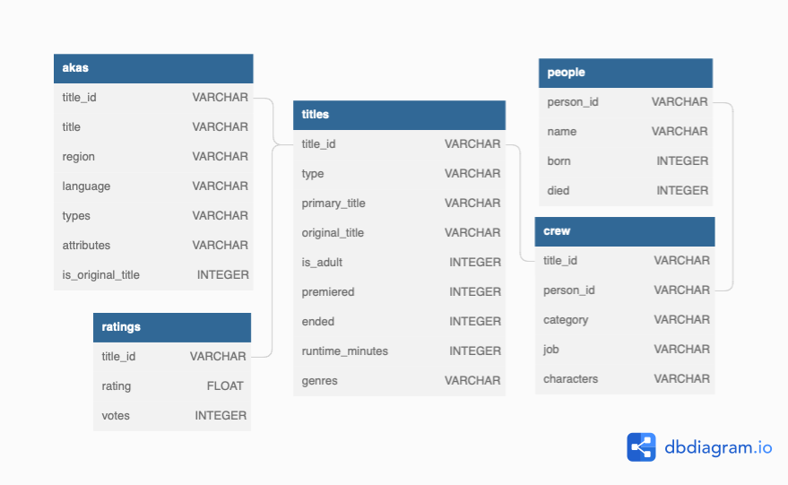

```sql
.tables
.schema $table
```


### schema
```sql
-- akas
CREATE TABLE akas (
  title_id VARCHAR, -- REFERENCES titles (title_id),
  title VARCHAR,
  region VARCHAR, -- will not use
  language VARCHAR,
  types VARCHAR, -- will not use
  attributes VARCHAR, -- will not use
  is_original_title INTEGER -- will not use
);
CREATE INDEX ix_akas_title_id ON akas (title_id);
CREATE INDEX ix_akas_title ON akas (title);
-- crew
CREATE TABLE crew (
  title_id VARCHAR, -- REFERENCES titles (title_id),
  person_id VARCHAR, -- REFERENCES people (person_id),
  category VARCHAR,
  job VARCHAR,
  characters VARCHAR
);
CREATE INDEX ix_crew_title_id ON crew (title_id);
CREATE INDEX ix_crew_person_id ON crew (person_id);
-- episodes
CREATE TABLE episodes (
  episode_title_id VARCHAR, -- REFERENCES titles (title_id),
  show_title_id VARCHAR, -- REFERENCES titles (title_id),
  season_number INTEGER,
  episode_number INTEGER
);
-- people
CREATE TABLE people (
  person_id VARCHAR PRIMARY KEY,
  name VARCHAR,
  born INTEGER,
  died INTEGER
);
CREATE INDEX ix_people_name ON people (name);
-- ratings
CREATE TABLE ratings (
  title_id VARCHAR PRIMARY KEY, -- REFERENCES titles (title_id),
  rating FLOAT,
  votes INTEGER
);
-- titles
CREATE TABLE titles (
  title_id VARCHAR PRIMARY KEY,
  type VARCHAR,
  primary_title VARCHAR,
  original_title VARCHAR,
  is_adult INTEGER,
  premiered INTEGER,
  ended INTEGER,
  runtime_minutes INTEGER,
  genres VARCHAR
);
CREATE INDEX ix_titles_type ON titles (type);
CREATE INDEX ix_titles_primary_title ON titles (primary_title);
CREATE INDEX ix_titles_original_title ON titles (original_title);
```

