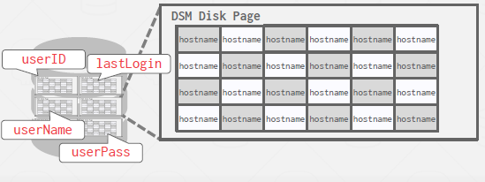

# Lecture 5. Storage Models & Compression

## Database Workloads

### OLTP: Online Transaction Processing

Fast operations that only read/update a small amount of data each time.

An example of an OLTP workload is the Amazon storefront. Users can add things to their cart, they can make purchases, but the actions only affect their account.


### OLAP: Online Analytical Processing

Complex queries that read a lot of data to compute aggregates.

An example of an OLAP workload would be Amazon computing the most bought item in Pittsburgh on a day when its raining.

\* HTAP: Hybrid Transaction + Analytical Processing (Buzzword)


## Storage Models

There are different ways to store tuples in pages. We have assumed the n-ary storage model so far. But the relational model does not specify that the DBMS must store all a tuple's attributes together in a single page. This may not actually be the best layout for some workloads, specifically for OLAP.

### N-Ary Storage Model (NSM)

In the n-ary storage model, the DBMS stores all of the attributes for a single tuple contiguously in a single page. This approach is ideal for OLTP workloads where requests are insert-heavy and transactions tend to operate only an individual entity. It is ideal because it takes only one fetch to be able to get all of the attributes for a single tuple.

Advantage:


Fast for inserts, updates, deletes & Good for queries that need the entire tuple.

<br/>

Disadvantage:


Not good for scanning large portions of the table and/or a subset of the attributes.


### Decomposition Storage Model (DSM)

In the decomposition storage model, the DBMS stores a single attribute (column) for all tuples contiguously in a block of data. Thus, it is also known as a `column store`. This model is ideal for OLAP workloads with many read-only queries that perform large scans over a subset of the table’s attributes.

Advantages:
- Reduces the amount of I/O wasted because the DBMS only reads the data that it needs for that query.
- Better query processing and data compression



Disadvantages:
- Slow for point queries, inserts, updates, and deletes because of tuple splitting/stitching.


To put the tuples back together when using a column store, there are two common approaches: The most
commonly used approach is fixed-length offsets. Here, you know that the value in a given column will match to another value in another column at the same offset, they will correspond to the same tuple. Therefore, every single value within the column will have to be the same length.

A less common approach is to use embedded tuple ids. Here, for every attribute in the columns, the DBMS
stores a tuple id (ex: a primary key) with it. The system then would also store a mapping to tell it how to jump to every attribute that has that id. Note that this method has a large storage overhead because it needs to store a tuple id for every attribute entry.


Today, almost all dbms uses dsm (even if it's mainly nsm, use dsm in seperate backend)

## Database Compression

I/O is the main bottleneck if the DBMS fetches data from disk during query execution. The DBMS can compress pages to increase the utility of the data moved per I/O operation.

If data sets are completely random bits, there would be no ways to perform compression. However, there
are key properties of real-world data sets that are amenable to compression:
- Data sets tend to have highly skewed distributions for attribute values (e.g., Zipfian distribution of the Brown Corpus).
- Data sets tend to have high correlation between attributes of the same tuple (e.g., Zip Code to City,
Order Date to Ship Date). 

Given this, we want a database compression scheme to have the following properties:
- Must `produce fixed-length values`. The only exception is var-length data stored in separate pools. This because the DBMS should follow word-alignment and be able to access data using offsets.
- Allow the DBMS to `postpone decompression as long as possible` during query execution (late materialization).
- Must be a `lossless scheme` because people do not like losing data. Any kind of lossy compression has to be performed at the application level.

### Compression Levels

- Block Level: Compress a block of tuples for the same table.
- Tuple Level: Compress the contents of the entire tuple (NSM only).
- Attribute Level: Compress a single attribute value within one tuple. Can target multiple attributes for the same tuple.
- Columnar Level: Compress multiple values for one or more attributes stored for multiple tuples (DSM only). This allows for more complicated compression schemes


### Naive Compression (Block Level)

The DBMS compresses data using a general purpose algorithm (e.g., gzip, LZO, LZ4, Snappy, Brotli, Oracle OZIP, Zstd). Although there are several compression algorithms that the DBMS could use, engineers often choose ones that often provides lower compression ratio in exchange for faster compress/decompress.

An example of using naive compression is in MySQL InnoDB. The DBMS compresses disk pages, pad them to a power of two KBs and stored them into the buffer pool. However, every time the DBMS tries to read data, the compressed data in the buffer pool has to be decompressed.

Since accessing data requires decompression of compressed data, this limits the scope of the compression scheme. If the goal is to compress the entire table into one giant block, using naive compression schemes would be impossible since the whole table needs to be compressed/decompressed for every access. Therefore, for MySQL, it breaks the table into smaller chunks since the compression scope is limited.

Another problem is that these naive schemes also do not consider the high-level meaning or semantics of the data. The algorithm is oblivious to neither the structure of the data, nor how the query is planning to access the data. Therefore, this gives away the opportunity to utilize late materialization, since the DBMS will not be able to tell when it will be able to delay the decompression of data.

### Columnar Compression (Columnar Level)


#### 1. Run-Length Encoding (RLE)

```
(value, start position, #elements in the run)
```


Works well with highly categorized, sorted data. Think if that Data was sorted, triplets stored are only two:
```
(M, 0, 6)
(F, 7, 2)
```

#### 2. Bit-Packing Encoding

When values for an attribute are always less than the value’s declared largest size, store them as smaller data type.


#### 3. Mostly Encoding

Bit-packing variant that uses a special marker to indicate when a value exceeds largest size and then maintain a look-up table to store them.


used by redshift.


#### 4. Bitmap Encoding

The DBMS stores a separate bitmap for each unique value for a particular attribute where an offset in the vector corresponds to a tuple. The ith position in the bitmap corresponds to the ith tuple in the table to indicate whether that value is present or not. The bitmap is typically segmented into chunks to avoid allocating large blocks of contiguous memory.


This approach is only practical if the value cardinality is low, since the size of the bitmap is linear to the cardinality of the attribute value. If the cardinalty of the value is high, then the bitmaps can become larger than the original data set.


#### 5. Delta Encoding

Recording the difference between values that follow each other in the same column. Combine with RLE to get even better compression ratios.


#### 6. Incremental Encoding

This is a type of delta encoding whereby common prefixes or suffixes and their lengths are recorded so that they need not be duplicated. This works best with sorted data.


#### 7. Dictionary Compression (Mostly use this)

The most common database compression scheme is dictionary encoding. The DBMS replaces frequent patterns in values with smaller codes. It then stores only these codes and a data structure (i.e., dictionary) that maps these codes to their original value. 

Dictionary:
- Needs to support fast encoding and decoding.
- Needs to also support range queries. (i.e. no hash map)


