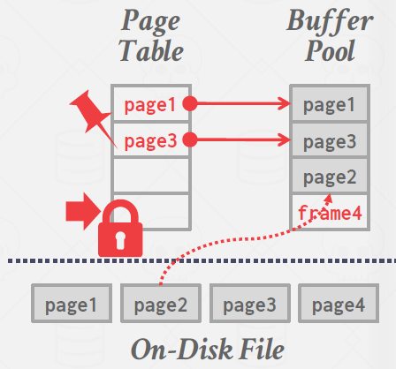
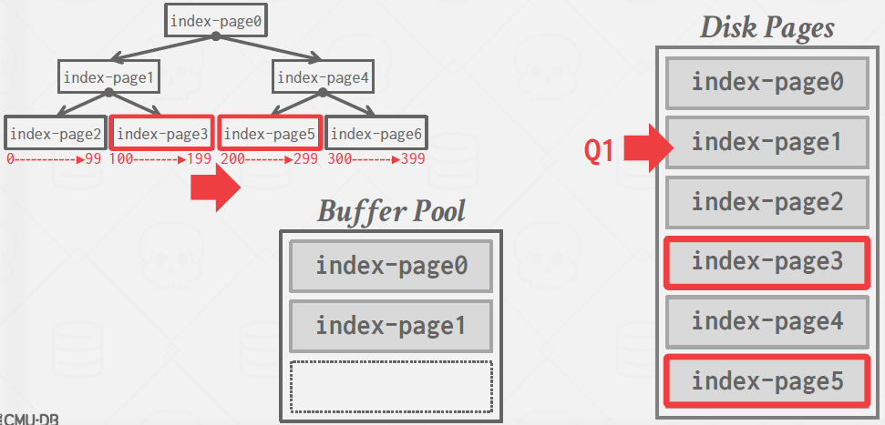
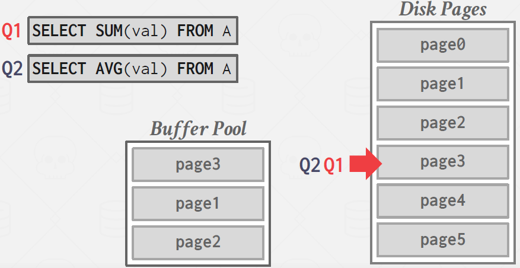
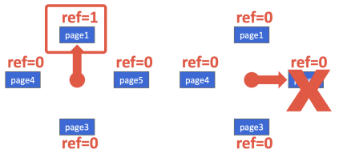

# Lecture 6. Buffer Pool

- Spatial Control
  - Where to write pages on disk
  - To keep pages that are used together often as physically close together as possible on disk
- Temporal Control
  - When to read pages into memory
  - To minimize the number of stalls from having to read data from disk

## Buffer Pool

The buffer pool is an in-memory cache of pages read from disk. It is essentially a large memory region allocated inside of the database to store pages that are fetched from disk. The buffer pool’s region of memory organized as an array of fixed size pages. Each array entry is called a `frame`.




(When 'need page2' arrives, acquire `latch` in some page table entry, get page2 from disk to buffer pool, and set pointer to that, release latch)

- Page Table
  - in-memory hash table that keeps track of pages that are currently in memory
  - page id to frame location
  - dirty-flag
    - not written to disk immediately (write-back cache)
  - pin/reference counter
    - A thread has to increment the counter before they access the page
    - If a page’s count is greater than zero, then the storage manager is not allowed to evict that page from memory.


\* page directory: page id to page location in db file. All changes must be recorded on disk to allow the DBMS to find on restart.

### Locks, Latches in Database Word

#### Locks
A lock is a higher-level, logical primitive that protects the contents of a database (e.g., tuples, tables, databases)
from other transactions. Transactions will hold a lock for its entire duration. Database systems can expose to the user
which locks are being held as queries are run. Locks need to be able to rollback changes.

#### Latches (~ mutex in OS Word)
A latch is a low-level protection primitive that the DBMS uses for the critical sections in its internal data
structures (e.g., hash tables, regions of memory). Latches are held for only the duration of the operation being made.
Latches do not need to be able to rollback changes.


## Buffer Pool Optimizations

- Global Policies
  - Considers all active transactions to find an optimal decision for allocating memory
- Local Policies
  - Decisions that will make a single query or transaction run faster, even if it isn’t good for the entire workload
  - Allocate frames to a specific transactions without considering the behavior of concurrent transactions.

\* Most systems use a combination of both global and local views

### Multiple Buffer Pools

The DBMS does not always have a single buffer pool for the entire system. Per-database, Per-page type are used. Each buffer pool can adopt local policies tailored for the data stored inside of it. This method can help reduce latch contention and improves locality.

example in DB2
```sql
CREATE BUFFERPOOL custom_pool
    SIZE 250 PAGESIZE 8k;
CREATE TABLESPACE custom_tablespace
    PAGESIZE 8k BUFFERPOOL custom_pool;
CREATE TABLE new_table
    TABLESPACE custom_tablespace ( ... );
```

How to spread records to multiple buffer pools?

- Objects IDs
  - Embed an object identifier in record ids and then maintain a mapping from objects to specific buffer pools.
- Hashing
  - Hash the page id to select which buffer pool to access.


### Pre-fetching

The DBMS can also optimize by pre-fetching pages based on the query plan. Then, while the first set of pages is being processed, the second can be pre-fetched into the buffer pool. This method is commonly used by DBMS’s when accessing many pages sequentially.

example:

```sql
SELECT * FROM a
    WHERE val BETWEEN 100 AND 250; -- val is indexed.
```



In B+ tree, first reads indexes to find where the records(index-page0, index-page1), and since now know what we need, prefetches index-page3 and index-page5.


### Scan Sharing (Synchronized Scans)

Query cursors can reuse data retrieved from storage or operator computations. This allows multiple queries to attach to a single cursor that scans a table. If a query starts a scan and if there one already doing this, then the DBMS will attach the second query’s cursor to the existing cursor. The DBMS keeps track of where the second query joined with the first so that it can finish the scan when it reaches the end of the data structure.



Q1 was doing scan starting page0. When it was reading page3, Q2 arrived, and attached to Q1's cursor. After reading page5, Q1 finishes, and Q2 reads through page0~2.


### Buffer Pool Bypass (Light Scans)

The sequential scan operator will not store fetched pages in the buffer pool to avoid overhead. Instead, memory is local to the running query. This works well if operator needs to read a large sequence of pages that are contiguous on disk. Buffer Pool Bypass can also be used for temporary data (sorting, joins).


### OS Page Cache

Most disk operations go through the OS API. Unless explicitly told otherwise, the OS maintains its own filesystem cache. Most DBMS use direct I/O (`O_DIRECT`) to bypass the OS’s cache in order to avoid redundant copies of pages and having to manage different eviction policies.

Postgres is an example of a database system that uses the OS’s Page Cache


## Buffer Replacement Policies

When the DBMS needs to free up a frame to make room for a new page, it must decide which page to evict from the buffer pool.

Goals:
- Correctness
- Accuracy
- Speed
- Meta-data overhead

### LRU

Maintain a single timestamp of when each page was last accessed. When the DBMS needs to evict a page, select the one with the oldest timestamp. This timestamp can be stored in a separate data structure, such as a queue, to allow for sorting and improve efficiency by reducing sort time on eviction.

### Clock

The CLOCK policy is an approximation of LRU without needing a separate timestamp per page. In the CLOCK policy, each page is given a reference bit. When a page is accessed, set to 1. Upon sweeping check if a page's bit is set to 1. If yes, set to zero, if no, then evict it. 



### Problems of LRU & Clock

Namely, LRU and CLOCK are susceptible to sequential flooding, where the buffer pool’s contents are corrupted due to a sequential scan. Since sequential scans read every page, the timestamps of pages read may not reflect which pages we actually want. In other words, the most recently used page is actually the most unneeded page.

### LRU-K

Track the history of last K references to each page as timestamps and compute the interval between subsequent accesses. The DBMS then uses this history to estimate the next time that page is going to be accessed. (If the page is not accessed K times, the value is infinity.)

### Localization

The DBMS chooses which pages to evict on a per transaction/query basis. This minimizes the pollution of the buffer pool from each query. (Postgres maintains a small ring buffer that is private to the query.)

### Priority Hints

The DBMS knows about the context of each page during query execution. It can provide hints to the buffer pool on whether a page is important or not.


