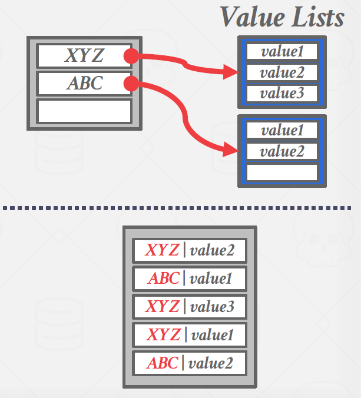
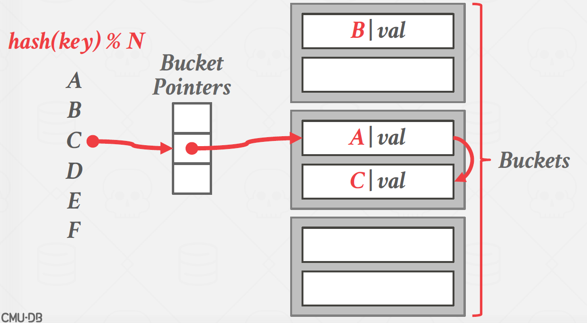
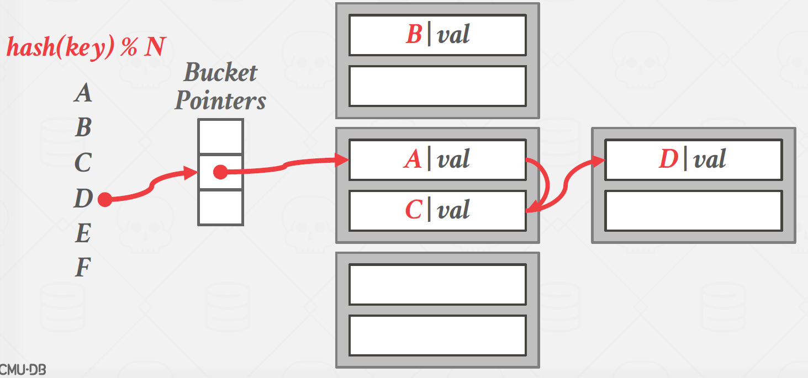
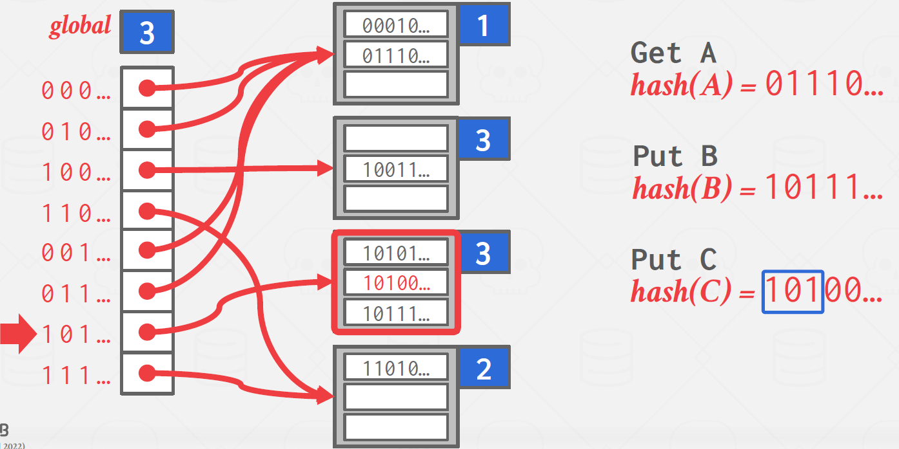
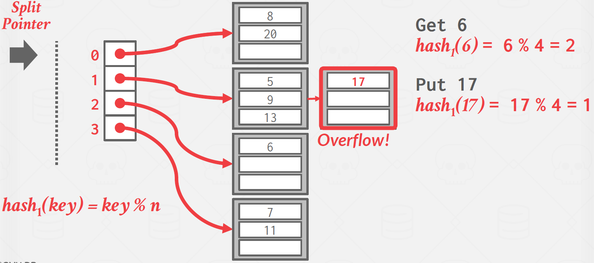
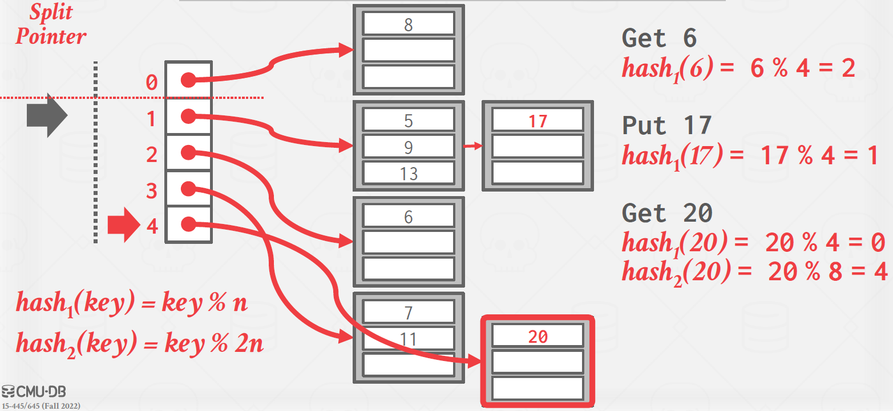

# Lecture 7. Hash Tables

## Data Structures

- Internal Meta-Data
  - Keeps track of information about the database and the system state.
  - Ex: Page tables, page directories
- Core Data Storage
  - Base storage for tuples in the database.
- Temporary Data Structures
  - The DBMS can build data structures on the fly while processing a query to speed up execution (e.g., hash tables for joins).
- Table Indices
  - Auxiliary data structures can be used to make it easier to find specific tuples.

## Hash Table

A hash table implements an associative array abstract data type that maps keys to values. It provides on average O(1) operation complexity (O(n) in the worst-case) and O(n) storage complexity. Note that even with O(1) operation complexity on average, there are constant factor optimizations which are important to consider in the real world.

- Hash Function
  - This tells us how to map a large key space into a smaller domain. It is used to compute an index into an array of buckets or slots. We need to consider the trade-off between fast execution and collision rate. On one extreme, we have a hash function that always returns a constant (very fast, but everything is a collision). On the other extreme, we have a “perfect” hashing function where there are no collisions, but would take extremely long to compute. The ideal design is somewhere in the middle.
  - A hash function takes in any key as its input. It then returns an integer representation of that key (i.e., the “hash”). The function’s output is deterministic (i.e., the same key should always generate the same hash output).
  - CRC-64 (1975), MurmurHash (2008), Google CityHash (2011), Facebook XXHash (2012), Google FarmHash (2014)
  - XXHash is the current state-of-the-art hash function

- Hashing Scheme
  - This tells us how to handle key collisions after hashing. Here, we need to consider the trade-off between allocating a large hash table to reduce collisions and having to execute additional instructions when a collision occurs.
  - `Static Hashing Scheme` vs `Dynamic Hashing Scheme`

\* In hash table we store pair of key and value to check the key if is there, since hashed value may collide.

## Static Hashing Scheme

#### Assumptions

1. Number of elements is known ahead of time and fixed
2. Each key is unique
3. Perfect hash function (if key1 != key2, then hash(key1) != hash(key2))
   - even for this assumption, since we use hash(key) % N, collision arise.
   - not in practice: nobody uses perfect hash function because it's complicated (they use hash table to make perfect hash function to build hash table...)

### 1. Linear Probe Hashing

The most basic hashing scheme. This is the most basic hashing scheme. It is also typically the fastest. It uses a circular buffer of array slots. 
- PUT: The hash function maps keys to slots. When a collision occurs, we linearly seach the adjacent slots until an open one is found. F
- GET: Check the slot the key hashes to, and search linearly until we find the desired entry. If we reach an empty slot or we iterated over every slot in the hashtable, then the key is not in the table.
- DELETE: Look for the element as GET, and then:
  - Instead of deleting the entry, we replace it with a `tombstone` entry which tells future lookups to keep scanning.
  - Shift the adjacent data after deleting an entry to fill the now empty slot. However, we must be careful to only move the entries which were originally shifted. This is rarely implemented in practice.

example:

|key|hash(key)%5|
|---|---|
|A|0|
|B|0|
|C|1|
```
N = 5
hash table: [None, None, None, None, None]

PUT A
hash table: [(A, alive, A_val), None, None, None, None]

PUT B (collision)
hash table: [(A, alive, A_val), (B, alive, B_val), None, None, None]

PUT C (collision)
hash table: [(A, alive, A_val), (B, alive, B_val), (C, alive, C_val), None, None]

GET C (check table[1] and compare with B, check table[2] and got C)

DELETE B
hash table: [(A, alive, A_val), (B, dead, B_val), (C, alive, C_val), None, None]

GET C (check table[1] and tombstone is there, check table[2] and got C)
```

#### Non unique keys?

In the case where the same key may be associated with multiple different values or tuples(assumption 2 fails), there are two approaches.

- Separate Linked List
  - Store values in separate storage area for each key
- Redundant Keys
  - Store key-value pair together in the hash table



### 2. Robin Hood Hashing

This is an extension of linear probe hashing that seeks to reduce the maximum distance of each key from their optimal position (i.e. the original slot they were hashed to) in the hash table. This strategy steals slots from “rich” keys and gives them to “poor” keys.

In this variant, each entry also records the “distance” they are from their optimal position. Then, on each insert, if the key being inserted would be farther away from their optimal position at the current slot than the current entry’s distance, we replace the current entry and continue trying to insert the old entry farther down the table.

\* Can cause flooding

example:

|key|hash(key)%5|
|---|---|
|A|0|
|B|0|
|C|1|
|D|0|
```
N = 5
hash table: [None, None, None, None, None]

PUT A
hash table: [(A, A_val, alive, 0), None, None, None, None]

PUT B
hash(B) = 0
table[0].dist == 0 -> skip index 0
table[1] is empty -> go there
hash table: [(A, A_val, alive, 0), (B, B_val, alive, 1), None, None, None]

PUT C
table[1].dist > 0 -> skip index 1
table[2] is empty -> go there
hash table: [(A, A_val, alive, 0), (B, B_val, alive, 1), (C, C_val, alive, 1), None, None]

PUT D
table[0].dist == 0 -> skip index 0
table[1].dist == 1 -> skip index 1
table[2].dist < 2 -> gangster index 2 and find new index for C
table[3] is empty -> go there
hash table: [(A, A_val, alive, 0), (B, B_val, alive, 1), (D, D_val, alive, 2), (C, C_val, alive, 2), None]
```

### 3. Cuckoo Hashing

Instead of using a single hash table, this approach maintains multiple hashtables with different hash functions. The hash functions are the same algorithm (e.g., XXHash, CityHash); they generate different hashes for the same key by using different seed values.

On insert, check every table and pick anyone that has a free slot. If no table has a free slot, evict the element from one of them and then re-hash it find a new location. In rare cases, we may end up in a cycle. If this happens, we can rebuild all of the hash tables with new hash function seeds (less common) or rebuild the hash tables using larger tables (more common).

example:

|key|hash1(key)|hash2(key)|
|---|---|---|
|A|1|3|
|B|1|0|
|C|1|0|

```
Table1: [None, None, None, None, ...]
Table2: [None, None, None, None, ...]

PUT A
Table1: [None, (A, A_val), None, None, ...]
Table2: [None, None, None, None, ...]

PUT B (In Table1, collision so try table2 and succeeds)
Table1: [None, (A, A_val), None, None, ...]
Table2: [(B, B_val), None, None, None, ...]

PUT C (Both failed so evict B in Table 2 and find new spot for B)
Table1: [None, (A, A_val), None, None, ...]
Table2: [(C, C_val), None, None, None, ...]
(B is evicted from table2 so evict A in table1 and find new spot for A)
Table1: [None, (B, B_val), None, None, ...]
Table2: [(C, C_val), None, None, None, ...]
(A can go to table 2)
Table1: [None, (B, B_val), None, None, ...]
Table2: [(C, C_val), None, None, (A, A_val), ...]

GET B (check table1 and table2 so O(1))
```


## Dynamic Hashing Schemes

The static hashing schemes require the DBMS to know the number of elements it wants to store. Otherwise it has to rebuild the table if it needs to grow/shrink in size.

Dynamic hashing schemes are able to resize the hash table on demand without needing to rebuild the entire table. The schemes perform this resizing in different ways that can either maximize reads or writes.

### 1. Chained Hashing

This is the most common dynamic hashing scheme. The DBMS maintains a linked list of buckets for each slot in the hash table. Keys which hash to the same slot are simply inserted into the linked list for that slot.

example:

|key|hash(key)%N|
|---|---|
|A|1|
|B|0|
|C|1|
|D|1|
|E|1|
|F|2|



When D arrives, makes new bucket and original one gets link to that new one.



### 2. Extendible Hashing

Improved variant of chained hashing that splits buckets instead of letting chains to grow forever. This approach allows multiple slot locations in the hash table to point to the same bucket chain.

The core idea behind re-balancing the hash table is to to move bucket entries on split and increase the number of bits to examine to find entries in the hash table. This means that the DBMS only has to move data within the buckets of the split chain; all other buckets are left untouched.

- The DBMS maintains a global and local depth bit counts that determine the number bits needed to find buckets in the slot array.
- When a bucket is full, the DBMS splits the bucket and reshuffle its elements. If the local depth of the split bucket is less than the global depth, then the new bucket is just added to the existing slot array. Otherwise, the DBMS doubles the size of the slot array to accommodate the new bucket and increments the global depth counter.

example:

- Using MSB of hash value
- Bucket size = 3
  
|key|hash(key)|
|---|---|
|x|00010...|
|y|10101...|
|z|10011...|
|w|11010...|
|u|11100...|
|A|01110...|
|B|10111...|
|C|10100...|

```
-- Initial (hash val for illustration)
global 1
[*0, *1] -- (0..., 1...)
0: [None, None, None] local 1
1: [None, None, None] local 1

PUT x (MSB with global = 0)
global 1
[*0, *1]
0: [(x, x_val, 00010), None, None] local 1
1: [None, None, None] local 1

PUT y (MSB with global = 1)
global 1
[*0, *1]
0: [(x, x_val, 00010), None, None] local 1
1: [(y, y_val, 10101), None, None] local 1

PUT z (MSB with global = 1)
global 1
[*0, *1]
0: [(x, x_val, 00010), None, None] local 1
1: [(y, y_val, 10101), (z, z_val, 10011), None] local 1

PUT w (MSB with global = 1)
global 1
[*0, *1]
0: [(x, x_val, 00010), None, None] local 1
1: [(y, y_val, 10101), (z, z_val, 10011), (w, w_val, 11010)] local 1

PUT u (MSB with global = 1)
bucket for 1 is full. split 1.
global 2
[*0, *0, *1, *2] -- (00..., 01..., 10..., 11...)
0: [(x, x_val, 00010), None, None] local 1
1: [(y, y_val, 10101), (z, z_val, 10011), None] local 2
2: [(w, w_val, 11010), (u, u_val, 11100), None] local 2

DELETE u (MSB with global = 11)
global 2
[*0, *0, *1, *2] -- (00..., 01..., 10..., 11...)
0: [(x, x_val, 00010), None, None] local 1
1: [(y, y_val, 10101), (z, z_val, 10011), None] local 2
2: [(w, w_val, 11010), None, None] local 2

PUT A (MSB with global = 01)
global 2
[*0, *0, *1, *2] -- (00..., 01..., 10..., 11...)
0: [(x, x_val, 00010), (A, A_val, 01110), None] local 1
1: [(y, y_val, 10101), (z, z_val, 10011), None] local 2
2: [(w, w_val, 11010), None, None] local 2
```


```
PUT B (MSB with global = 10)
global 2
[*0, *0, *1, *2] -- (00..., 01..., 10..., 11...)
0: [(x, x_val, 00010), (A, A_val, 01110), None] local 1
1: [(y, y_val, 10101), (z, z_val, 10011), (B, B_val, 10111)] local 2
2: [(w, w_val, 11010), None, None] local 2

PUT C (MSB with global = 10)
bucket 1 is full. split 1.
global 3
[*0, *0, *0, *0, *1, *3, *2, *2] -- (000..., 001..., 010..., 011..., 100..., 101..., 110..., 111...)
0: [(x, x_val, 00010), (A, A_val, 01110), None] local 1
1: [None, (z, z_val, 10011), None] local 3
2: [(w, w_val, 11010), None, None] local 2
3: [(y, y_val, 10101), (B, B_val, 10111), (C, C_val, 10100)] local 3
```


### 3. Linear Hashing

Instead of immediately splitting a bucket when it overflows, this scheme maintains a split pointer that keeps track of the next bucket to split. No matter whether this pointer is pointing to a bucket that overflowed, the DBMS always splits. The overflow criterion is left up to the implementation.
- When any bucket overflows, split the bucket at the pointer location by adding a new slot entry, and
create a new hash function.
- If the hash function maps to slot that has previously been pointed to by pointer, apply the new hash function.
- When the pointer reaches last slot, delete original hash function and replace it with a new hash function.



When PUT 17, overflow occured. Instead of spliting bucket 1, just add linked list. And split what's split pointer is pointing(which is 0). Now key 20 is in bucket 4.



Splitting buckets based on the split pointer will eventually get to all overflowed buckets.


