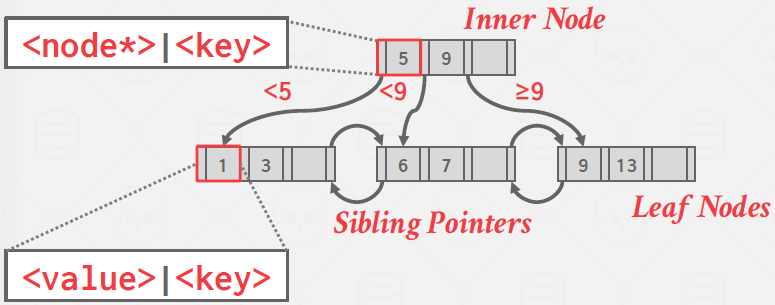
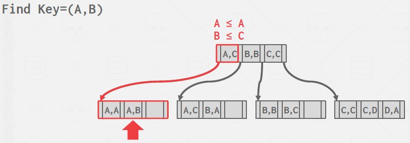
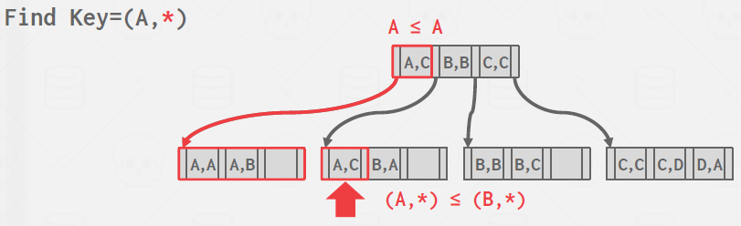
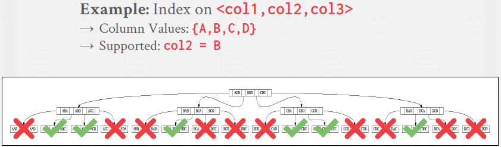
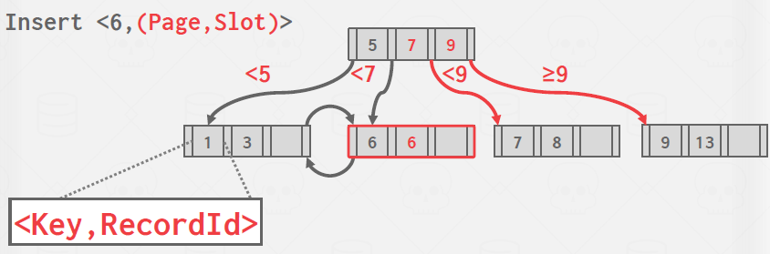
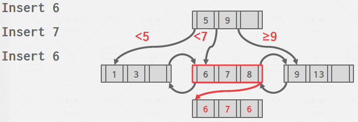
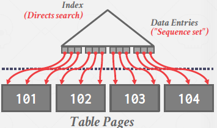
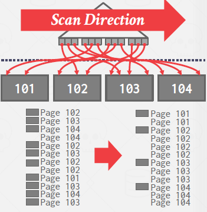

# Lecture 8. B+Tree

Refer to last time's dbms data structures:
- Internal Meta-data
- Core Data Storage
- Temporary Data Structures
- `Table Indexes`

A table index is a replica of a subset of a table’s columns that is organized and/or sorted for efficient access using a subset of those attributes. So instead of performing a sequential scan, the DBMS can lookup the table index’s auxiliary data structure to find tuples more quickly. The DBMS ensures that the contents of the tables and the indexes are always logically in sync.

## B+Tree

A B+Tree is a self-balancing tree data structure that keeps data sorted and allows searches, sequential access, insertion, and deletions in `O(log(n))`. It is optimized for disk-oriented DBMS’s that read/write large blocks of data.

Almost every modern DBMS that supports order-preserving indexes uses a B+Tree. There is a specific data structure called a B-Tree, but people also use the term to generally refer to a class of data structures. The primary difference between the original B-Tree and the B+Tree is that B-Trees stores keys and values in all nodes, while `B+ trees store values only in leaf nodes`. Modern B+Tree implementations combine features from other B-Tree variants, such as the sibling pointers used in the Blink-Tree.

Formally, a B+Tree is an M-way search tree (where M represents the maximum number of children a node can have) with the following properties:
- It is perfectly balanced (i.e., every leaf node is at the same depth).
- Every inner node other than the root is at least half full (M/2 − 1 <= num of keys <= M − 1).
- Every inner node with k keys has k+1 non-null children

example: 4-way

There exists sibling pointers to prevent multiple threads go oposite direction (left to root).

Every B+Tree node is comprised of an array of key/value pairs. The arrays are (usually) kept in sorted key order. 
- The keys are derived from the attribute(s) that the index is based on.
- The values will differ based on whether the node is classified as an inner node or a leaf node.
    - inner node
      - value = pointer to other node
    - leaf node (two approaches)
      - Record IDs -- PostgreSQL, SQLServer, DB2, Oracle
        - pointer to the location of the tuple
      - Tuple data -- SQLite, MySQL, DB2, Oracle
        - store actual contents of the tuple in each node
        - Secondary indexes must store the Record ID as their values. (when using secondary key, it will return primary key and get value from primary key's b+tree)

Conceptually, the keys on the inner nodes can be thought of as guide posts. They guide the tree traversal but do not represent the keys (and hence their values) on the leaf nodes. What this means is that you could potentially have a key in an inner node (as a guide post) that is not found on the leaf nodes. Although it must be noted that conventionally inner nodes posses only those keys that are present in the leaf nodes.

[Illustration](https://www.cs.usfca.edu/~galles/visualization/BPlusTree.html)

### Insert

1. Find correct leaf L.
2. Add new entry into L in sorted order:
   - If L has enough space, the operation is done.
   - Otherwise split L into two nodes L and L2. Redistribute entries evenly and copy up middle key. Insert index entry pointing to L2 into parent of L.
3. To split an inner node, redistribute entries evenly, but push up the middle key

### Delete

1. Find correct leaf L.
2. Remove the entry:
   - If L is at least half full, the operation is done.
   - Otherwise, you can try to redistribute, borrowing from sibling.
   - If redistribution fails, merge L and sibling.
3. If merge occurred, you must delete entry in parent pointing to L.

SEE CHAPTER 14 FOR DETAILED SUDO CODE

---

### Selection Coniditions: Multiple index search

Because B+Trees are in sorted order, look ups have fast traversal and also do not require the entire key. The DBMS can use a B+Tree index if the query provides any of the attributes of the search key. This differs from a hash index, which requires all attributes in the search key.

### Duplicate Keys

1. Append Record ID
   - each tuple’s record ID is unique
   - 
2. Overflow Leaf Nodes
   - Allow leaf nodes to spill into overflow nodes that contain the duplicate keys.
   - Complex
   - 

---

### Clustered vs Unclustered index

- Clustered
  - The table is stored in the sort order specified by the primary key, as either heap- or index-organized storage. Since some DBMSs always use a clustered index, they will automatically make a hidden row id primary key if a table doesn’t have an explicit one, but others cannot use them at all.
  - Traverse to the left-most leaf page and then retrieve tuples from all leaf pages. This will always be better than sorting data for each query.
  - 
- Unclustered
  - Retrieving tuples in the order they appear in a non-clustered index is inefficient due to redundant reads.
  - DBMS will first figure out all the tuples that it needs and then sort them based on page id.
  - 

\* Clustering could not make big difference. Column db would.

