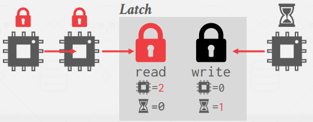
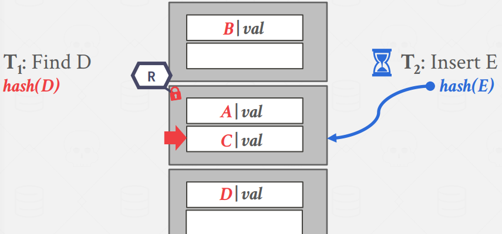
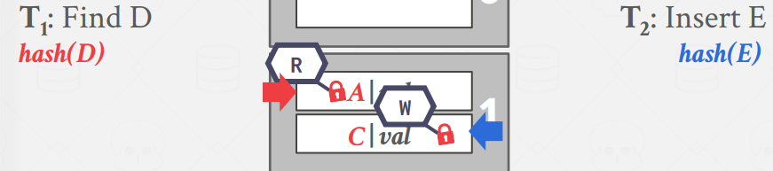
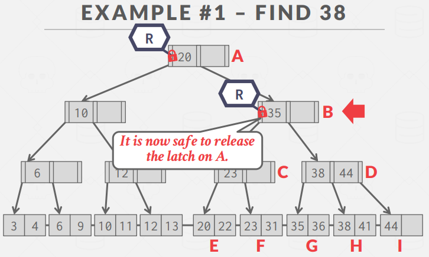
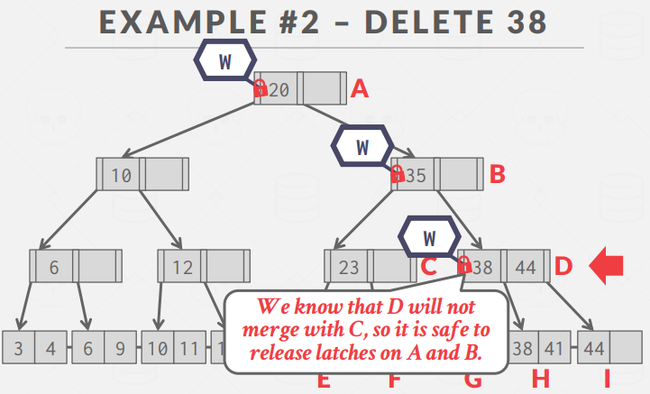

# Lecture 9. Index Concurrecy Control

A concurrency control protocol is the method that the DBMS uses to ensure "correct" results for concurrent operations on a shared object.

A protocol’s correctness criteria can vary:
- Logical Correctness: This means that the thread is able to read values that it should expects to read.
  
    e.g. a thread should read back the value it had written previously.

- `Physical Correctness`: This means that the internal representation of the object is sound. We focus on this in this lecture.
  
    e.g. there are not pointers in the data structure that will cause a thread to read invalid memory locations.

## 1. Latches

### 1.1. Blocking OS Mutex

`std::mutex`, `pthread_mutex`, `futex` (for linux's fast user-space mutex)

Linux provides the `futex` (fast user-space mutex), which is comprised of (1) a spin latch in user-space and (2) an OS-level mutex. If one acquires user-space latch, it's set. If not, tries to acquire os-level mutex, which is expensive.

- Advantages: Simple to use and requires no additional coding in DBMS.
- Disadvantages: Expensive and non-scalable (about 25 ns per lock/unlock invocation) because of OS scheduling.

### 1.2. Test-and-Set Spin Latch (TAS)

`std::atomic<T>`

- Advantages: Latch/unlatch operations are efficient (single instruction to lock/unlock).
- Disadvantages: Not scalable nor cache-friendly because with multiple threads, the CAS instructions
will be executed multiple times in different threads. These wasted instructions will pile up in high
contention environments; the threads look busy to the OS even though they are not doing useful work.
This leads to cache coherence problems because threads are polling cache lines on other CPUs.

### 1.3. Reader-Writer Latches

`std::shared_mutex`, `pthread_rwlock`

Mutexes and Spin Latches do not differentiate between reads/writes, this does. The DBMS needs a way to allow for concurrent reads, so if the application has heavy reads it will have better performance because readers can share resources instead of waiting.

- Advantages: Allows for concurrent readers.
- Disadvantages: The DBMS has to manage read/write queues to avoid starvation. Larger storage overhead than spin Latches due to additional meta-data.

## 2. Hash Table Latching

### 2.1. Static Hash

All threads move in the same direction and only access a single page/slot at a time. Threads also only access a single page/slot at a time. Thus, deadlocks are not possible.

To resize the table, take a global write latch on the entire table (e.g., in the header page).

### 2.2. Dynamic Hash

#### APPROACH 1: Page Latches

Each page has its own Reader-Writer latch that protects its entire contents. Threads acquire either a read or write latch before they access a page. This decreases parallelism because potentially only one thread can access a page at a time, but accessing multiple slots in a page will be fast for a single thread because it only has to acquire a single latch.

#### APPROACH 2: Slot Latches

Each slot has its own latch. This increases parallelism because two threads can access different slots on the same page. But it increases the storage and computational overhead of accessing the table because threads have to acquire a latch for every slot they access, and each slot has to store data for the latches. The DBMS can use a single mode latch (i.e., Spin Latch) to reduce meta-data and computational overhead at the cost of some parallelism.

## 3. B+Tree Latching

Two problems to solve:
- Threads trying to modify the contents of a node at the same time.
- One thread traversing the tree while another thread splits/merges nodes.

Basic idea is `crabbing`:

1. Get latch for the parent.
2. Get latch for the child.
3. Release latch for the parent if the child is deemed “safe”. A “safe” node is one that will not split, merge, or redistribute when updated.

### 3.1. Basic Latch Crabbing

- Search: Start at the root and go down, repeatedly acquire latch on the child and then unlatch parent.
  
  
- Insert/Delete: Start at the root and go down, obtaining X latches as needed. Once the child is latched, check if it is safe. If the child is safe, release latches on all its ancestors. But, taking a write latch on the root every time becomes a bottleneck with higher concurrency
  
  

### 3.2. Better Latching (cutting 3.1.)

Most modifications to a B+Tree will not require a split or merge. Each transaction will assume that the path to the target leaf
node is safe, and use READ latches and crabbing to reach it and verify. If the leaf node is not safe, then we abort and do the previous algorithm where we acquire WRITE latches. (Try optimistic and re-try with basic if fails)

## 4. Leaf Node Scans in B+Tree

For crabbing algorithm, it's top-down manner so there cannot be deadlock. However, leaf node scans are susceptible to deadlocks because now we have threads trying to acquire exclusive locks in two different directions at the same time (e.g., thread 1 tries to delete, thread 2 does a leaf node scan). Index latches do not support deadlock detection or avoidance.

And that's why they hire expensive, smart engineers.

