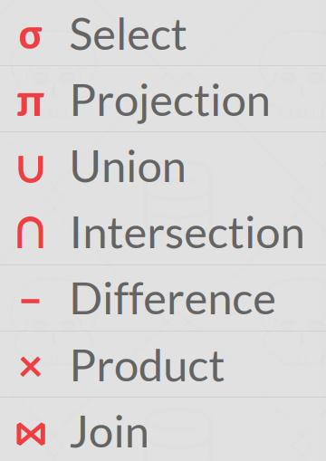

Database is an organized collection of inter-related data that
models some aspect of the real-world. Database system is the software that manages that.

### Example: digital music store

Things we need for our store:
- Information about Artists
- What Albums those Artists released

How about to store our database as comma-separated value(CSV) files that we manage ourselves in our application code?
- Use a separate file per entity.
- The application must parse the files each time they want to read/update records.

Example: Get the year that GZA went solo.

Artist(name, year, country)
```
"Wu-Tang Clan",1992,"USA"
"Notorious BIG",1992,"USA"
"GZA",1990,"USA"
```
Get the year that GZA went solo?
```python
for line in file.readlines():
    record = parse(line)
        if record[0] == "GZA":
            print(int(record[1]))
```
Problem1: DATA INTEGRITY

- How do we ensure that the artist is the same for each album entry?
- What if somebody overwrites the album year with an invalid string?
- What if there are multiple artists on an album?
- What happens if we delete an artist that has albums?


Problem2: IMPLEMENTATION

- How do you find a particular record?
- What if we now want to create a new application that uses the same database?
- What if two threads try to write to the same file at the same time?

Problem3: DURABILITY

- What if the machine crashes while our program is updating a record?
- What if we want to replicate the database on multiple machines for high availability?

THESE ARE THE REASON WHY WE NEED DBMS.

---

A database management system (DBMS) is software that allows applications to store and
analyze information in a database. A general-purpose DBMS supports the definition, creation, querying, update, and administration of databases in accordance with some data model.

- `DATA MODEL` is a collection of concepts for describing the data in a database.

  - Relational (This course mainly use this)
  - Key/Value (NoSQL)
  - Graph (NoSQL)
  - Document / Object (NoSQL)
  - Wide-Column / Column-family (NoSQL)
  - Array / Matrix / Vectors (Machine Learning)
  - Hierarchical (Obsolete/Legacy/Rare <- do not use it...)
  - Network (Obsolete/Legacy/Rare <- do not use it...)
  - Multi-Value (Obsolete/Legacy/Rare <- do not use it...)

- `SCHEMA` is a description of a particular collection of data, using a given data model.


The relational model defines a database abstraction based on relations to avoid maintenance overhead. It stores database in simple data structures(relational). Physical storage left up to the DBMS implementation. Instead of using some low level language to manage data, it accesss data through high-level language, DBMS figures out best execution strategy.

- Structure: The definition of the database's relations and their contents.
- Integrity: Ensure the database's contents satisfy constraints.
- Manipulation: Programming interface for accessing and modifying a database's contents.

A `relation` is an unordered set that contain the relationship of attributes that represent entities.

A tuple is a set of attribute values (also known as its domain) in the relation.
- Values are (normally) atomic/scalar.
- The special value NULL is a member of every domain (if allowed).


Example revisited with relational model:

|name|year|country|
|---|---|---|
|Wu-Tang Clan|1992|USA|
|Notorious Big|1992|USA|
|GZA|1990|USA|

A relation's primary key uniquely identifies a single tuple. Some DBMSs automatically create an internal primary key if a table does not define one. (`SEQUENCE` (SQL:2003), `AUTO_INCREMENT` (MySQL))


### Data Manipulation Languages (DML)

Methods to store and retrieve information from a database.

- Procedural: The query specifies the (high-level) strategy to find the desired result based on sets / bags.
  - Relational Algebra
- Non-Procedural (Declarative): The query specifies only what data is wanted and not how to find it.
  - Relational Calculus


### Relational Algebra

Fundamental operations to retrieve and manipulate tuples in a relation. Based on set algebra



(((see lecture slide for detailed examples.)))


- SELECT

Choose a subset of the tuples from a relation that satisfies a selection predicate.


- PROJECTION
  
Generate a relation with tuples that contains only the specified attributes

- UNION

Generate a relation that contains all tuples that appear in either only one or both input relations.


- INTERSECTION

Generate a relation that contains only the tuples that appear in both of the input relations.


- DIFFERENCE

Generate a relation that contains only the tuples that appear in the first and not the second of the input relations.

- PRODUCT

Generate a relation that contains all possible combinations of tuples from the input relations.

- JOIN

Generate a relation that contains all tuples that are a combination of two tuples (one from each input relation) with a common value(s) for one or more attributes.


\* There are more: Rename, Assignment, Duplicate Elimination, Aggregation, Sorting, Division


