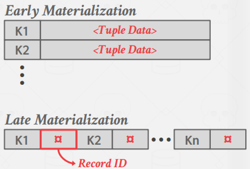
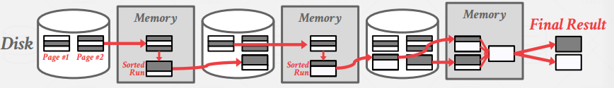
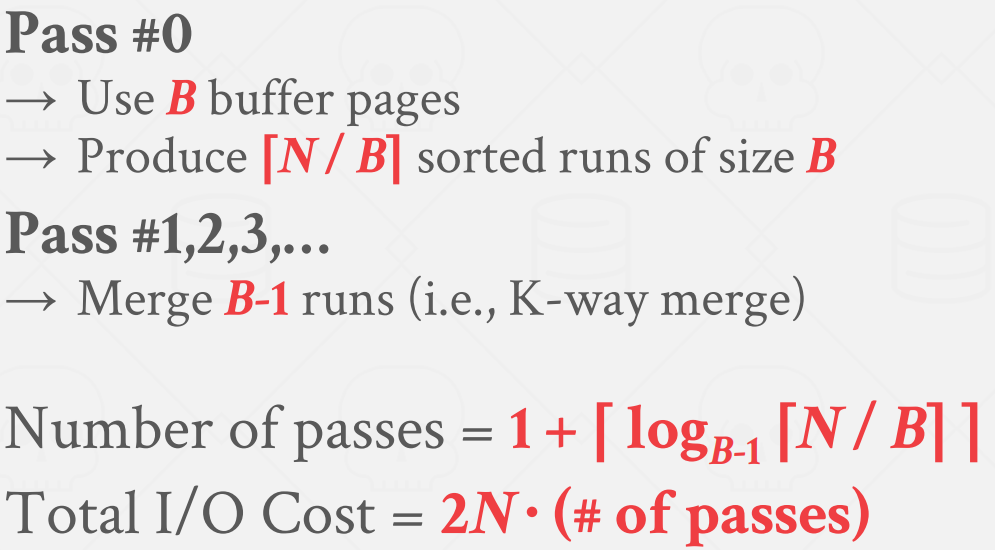
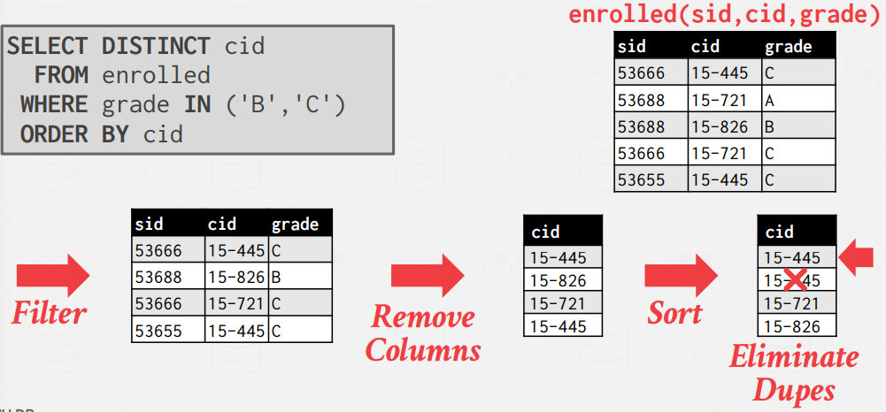
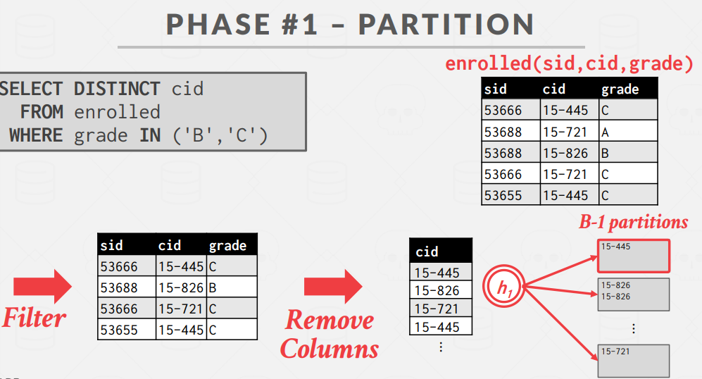
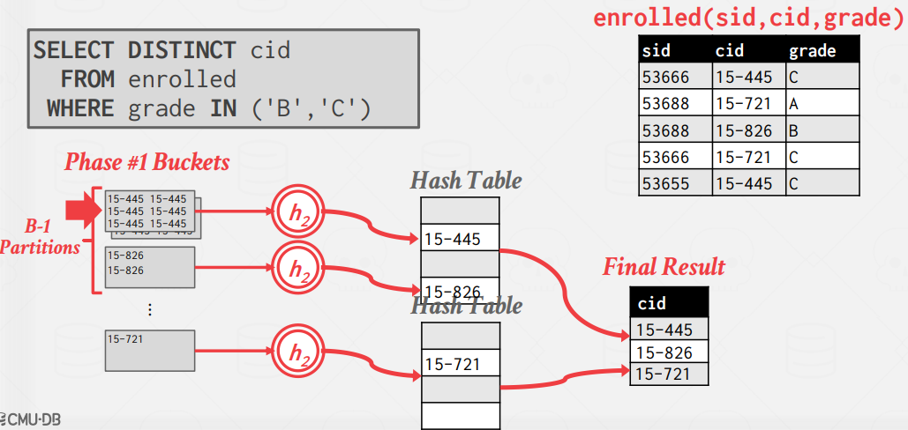

# Lecture 10. Sorting & Aggregations

Just like it cannot assume that a table fits entirely in memory, a disk-oriented DBMS cannot assume that query results fit in memory. Disk I/O will be the bottleneck, so calculate cost on that.

## 1. Sorting

Sorting is (potentially) used in `ORDER BY`, `GROUP BY`, `JOIN`, and `DISTINCT` operators.

- If data fits in memory, then we can use a standard sorting algorithm like quicksort. 
- If data does not fit in memory, then we need to use a technique that is aware of the cost of reading and writing disk pages (below, external merge sort)

### 1.1. External Merge Sort

Divide-and-conquer algorithm that splits data into separate runs, sorts them individually, and then combines them into longer sorted runs.

In Sorting phase, sorts small chunks of data that fit in main memory, and then writes the sorted pages back to disk. 

- Key: The attribute(s) to compare to compute the sort order.
- Value: Two choices
  - Tuple (early materialization).
  - Record ID (late materialization).

#### 2-way External Merge Sort

- `N`: Total data pages
- `B`: Buffer pool pages the DBMS has.

1. Pass #0
   - `Read` all B pages of the table into memory, sort, then `write` back to disk.
2. Pass #1,2,3,...
   - Recursively merge pairs of runs into runs twice as long. need 2 buffer pages for input pages, 1 for output.
    

    

`Double Buffering Optimization`: One optimization for external merge sort is prefetching the next run in the background and storing it in a second buffer while the system is processing the current run. This reduces the wait time for I/O requests at each step by continuously utilizing the disk. This optimization requires the use of multiple threads, since the prefetching should occur while the computation for the current run is happening.

#### k-way External Merge Sort

Instead of chunking per-page and use only 3 buffer pages while merging, let's use `B - 1` groups. This leads:

    

### 1.2. Comparison Optimization

#### Code Specialization

Instead of providing a comparison function as a pointer to sorting algorithm, create a hardcoded version of sort that is specific to a key type.

#### Suffix Truncation

First compare a binary prefix of long VARCHAR keys instead of slower string comparison. Fallback to slower version if prefixes are equal. (seems like the basic idea of adix sort?)

## 2. Aggregation

An aggregation operator in a query plan collapses the values of one or more tuples into a single scalar value.
There are two approaches for implementing an aggregation: `Sorting`, `Hashing`

### 2.1. Sorting Aggregation

The DBMS first sorts the tuples on the GROUP BY key(s). Then performs a sequential scan over the sorted data to compute the
aggregation. The output of the operator will be sorted on the keys.

When performing sorting aggregations, it is important to order the query operations to maximize efficiency.
For example, if the query requires a filter, it is better to perform the filter first and then sort the filtered data
to reduce the amount of data that needs to be sorted.

    

### 2.2. Hashing Aggregation

Hashing is a better alternative in this scenario. 

ALGORITHM: Populate an ephemeral hash table as the DBMS scans the table. For each record, check whether there is already an entry in the hash table as
- DISTINCT: Discard duplicate
- GROUP BY: Perform aggregate computation

If the size of the hash table is too large to fit in memory, then the DBMS has to spill it to disk. There are two phases to accomplishing this:

#### Phase 1. Partition

Use a hash function `h1` to split tuples into partitions on disk based on target hash key.

    

#### Phase 2. ReHash

For each partition on disk, read its pages into memory and build an in-memory hash table based on a second hash function h2 (where h1 ̸= h2). Then go through each bucket of this hash table to bring together matching tuples to compute the aggregation. This assumes that each partition fits in memory.

    

