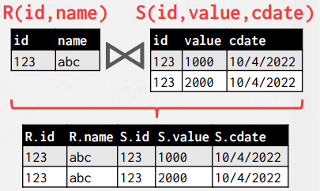
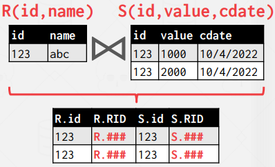
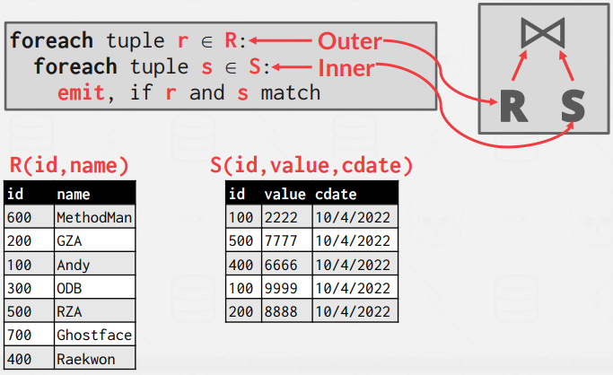
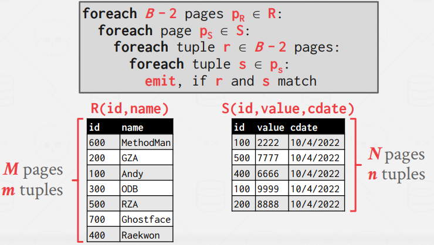
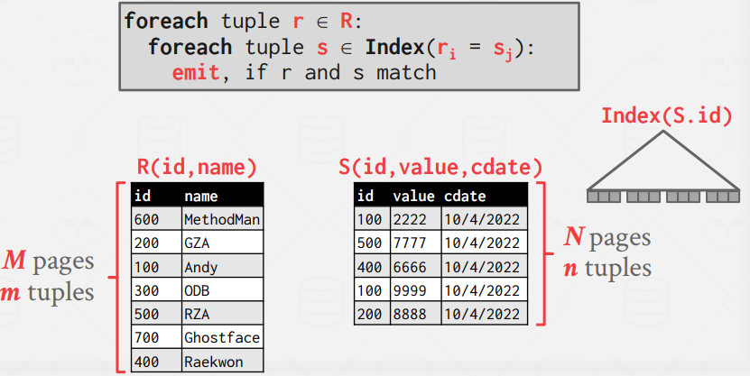
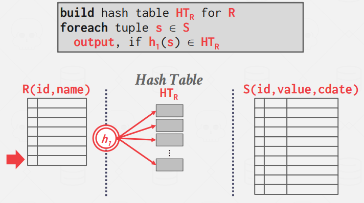
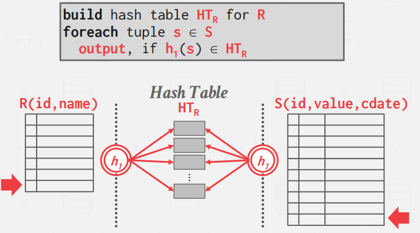
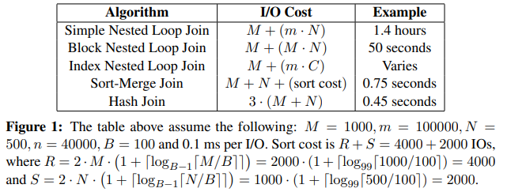

# Lecture 11. Join

The goal of a good database design is to minimize the amount of information repetition. This is why tables
are composed based on normalization theory. Joins are therefore needed to reconstruct the original tables.

This class will cover inner equijoin algorithms for combining two-tables. An equijoin algorithm joins
tables where keys are equal. These algorithms can be tweaked to support other joins.

In general, we want the smaller table to always be the left table ("outer table") in the query plan.

There are multiple approaches to the contents of the join operator output.

`Early Materialization` copies the values for the attributes in the outer and inner tables into tuples put into an intermediate result table just for that operator. Future operators in the query plan never need to go back to the base tables to get more data, but requires more memory to materialize the entire tuple. 



`Late Materialization` only copies the join keys along with the record ids of the matching tuples. This approach is ideal for column stores.



While doing cost analysis, let's assume:

- `M` pages, `m` tuples in table R 
- `N` pages, `n` tuples in table S
- R is outter table

## 1. Nested Loop Join

### 1.1. Stupid Nested Loop Join



Entire scan of the inner table for each tuple in the outer table without any caching or access locality.

Cost: $M + m \cdot N$

### 1.2. Block Nested Loop Join



If we have 3 buffers, we can fetch outer table's page and inner table's page. (one for output)

Cost: $M + M \cdot N$

If we have B buffers, we can use $B - 2$ buffers to scan the outer table.

Cost: $M + \left(\lceil \frac{M}{B - 2} \rceil \cdot N \right)$

### 1.3. Index Nested Loop Join



The previous nested loop join algorithms perform poorly. However, if the database already has an index for one of the tables on
the join key, it can use that to speed up the comparison. The outer table will be the one without an index. The inner table will be the one with the index.

Cost: $M + m \cdot C$

Assume the cost of each index probe is some constant value $C$ per tuple.


## 2. Sort-Merge Join

At a high-level, a sort-merge join sorts the two tables on their join key(s). The DBMS can use the external mergesort algorithm for this. It then steps through each of the tables with cursors and emits matches (like in mergesort).

This algorithm is useful if one or both tables are already sorted on join attribute(s) (like with a clustered index) or if the output needs to be sorted on the join key anyways.


```pseudo
pr := address of first tuple of r;
ps := address of first tuple of s;
while (ps ≠ null and pr ≠ null) do
    begin
        ts := tuple to which ps points;
        Ss := {ts};
        set ps to point to next tuple of s;
        done := false;
        //----------------------------------- getting all ts duplicates in S
        while (not done and ps ≠ null) do
            begin
            ts′ := tuple to which ps points;
            if (ts′[JoinAttrs] = ts[JoinAttrs])
                then begin
                        Ss := Ss ∪ {ts′};
                        set ps to point to next tuple of s;
                    end
                else done := true;
            end
        //----------------------------------- make tr same to ts
        tr := tuple to which pr points;
        while (pr ≠ null and tr[JoinAttrs] < ts[JoinAttrs]) do
            begin
                set pr to point to next tuple of r;
                tr := tuple to which pr points;
            end
        //----------------------------------- join main algorithm
        while (pr ≠ null and tr[JoinAttrs] = ts[JoinAttrs]) do
            begin
                for each ts in Ss do
                    begin
                        add ts ⋈ tr to result;
                    end
                set pr to point to next tuple of r;
                tr := tuple to which pr points;
            end
    end.
```

- R Sort Cost: $2M \cdot \left( 1 + \lceil \log_{B-1}\lceil \frac{M}{B} \rceil \rceil \right)$

- S Sort Cost: $2N \cdot \left( 1 + \lceil \log_{B-1}\lceil \frac{N}{B} \rceil \rceil \right)$

- Merge Cost: $M + N$ (in worst case, $M \cdot N$)

The worst case for the merging phase is when the join attribute of all the tuples in both relations contains the same value.


## 3. Hash Join


The high-level idea of the hash join algorithm is to use a hash table to split up the tuples into smaller chunks based on their join attribute(s). Hash joins can only be used for equi-joins on the complete join key.

#### Phase 1. Build

Scan the outer relation and populate a hash table using the hash function h1 on the join attributtes.




#### Phase 2. Probe

Scan the inner relation and use the hash function h1 on each tuple’s join attributes to jump to the corresponding location in the hash table and find a matching tuple. We can cut linear probing using Bloom Filter.



Cost: $B \cdot (B - 1)$

### 3.1. Grace Hash Join (Partitioned Hash Join)

When the tables do not fit on main memory, the DBMS has to swap tables in and out essentially at random, which leads to poor performance. The Grace Hash Join is an extension of the basic hash join that also hashes the inner table into partitions that are written out to disk.

#### Phase 1. Build

Scan both the outer and inner tables and populate a hash table using the hash function h1 on the join attributes. The hash table’s buckets are written out to disk as needed. If a single bucket does not fit in memory, the DBMS can use recursive partitioning with different hash function h2 (where h1 ̸= h2) to further divide the bucket. This can continue recursively until the buckets fit into memory.

#### Phase 2. Probe

For each bucket level, retrieve the corresponding pages for both outer and inner tables. Then, perform a nested loop join on the tuples in those two pages. The pages will fit in memory, so this join operation will be fast.


pseudo-code in the textbook chapter 15 is as below
```
/* Partition s */
for each tuple ts in s do begin
    i := h(ts[JoinAttrs]);
    Hsi := Hsi ∪ {ts};
end

/* Partition r */
for each tuple tr in r do begin
    i := h(tr[JoinAttrs]);
    Hri := Hri ∪ {tr};
end

/* Perform join on each partition */
for i := 0 to nh do begin
    read Hsi and build an in-memory hash index on it;
    for each tuple tr in Hri do begin
        probe the hash index on Hsi to locate all tuples ts such that ts[JoinAttrs] = tr[JoinAttrs];
    for each matching tuple ts in Hsi
        do begin
            add tr ⋈ ts to the result;
        end
    end
end
```

- Partitioning Phase Cost: $2 \cdot (M + N)$
- Probe Phase Cost: $M + N$


## 4. Conclusion
<p align="center">

</p>


Hash joins are almost always better than sort-based join algorithms, but there are cases in which sortingbased joins would be preferred. This includes queries on non-uniform data, when the data is already sorted on the join key, and when the result needs to be sorted. Good DBMSs will use either, or both.