# Lecture 12. Query Execution

This lecture deals with single worker.

## 1. Processing Models

A DBMS processing model defines how the system executes a query plan. It specifies things like the direction in which the query plan is evaluated and what kind of data is passed between operators along the way.

These models can all be implemented either from top-to-bottom or from bottomto-top. Although the top-to-bottom approach is much more common, the bottom-to-top approach can allow for tighter control of caches/registers in pipelines.

### 1.1. Iterator Model

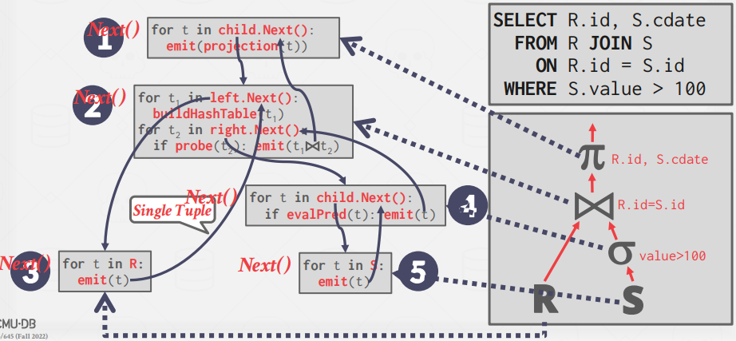

Each query plan operator implements a `Next()` function. On each invocation, the operator returns either a single tuple or a null marker if there are no more tuples. The operator implements a loop that calls Next() on its children to retrieve their tuples and then process them.

### 1.2. Materialization Model

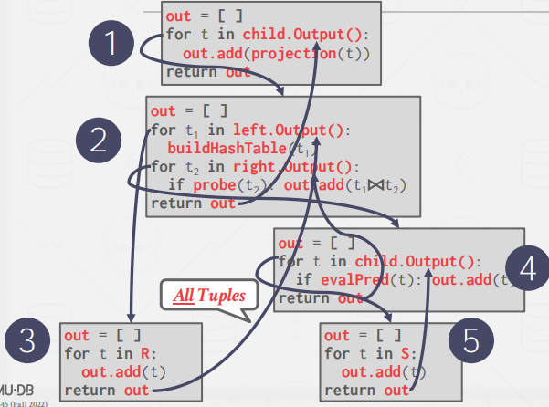

Each operator processes its input all at once and then emits its output `all at once`. The operator "materializes" its output as a single result. The DBMS can push down hints (e.g., LIMIT) to avoid scanning too many tuples. Can send either a materialized row or a single column.

This approach is better for OLTP workloads because queries typically only access a small number of tuples
at a time. Thus, there are fewer function calls to retrieve tuples. The materialization model is not suited
for OLAP queries with large intermediate results because the DBMS may have to spill those results to disk
between operators.

### 1.3. Vectorized / Batch Model

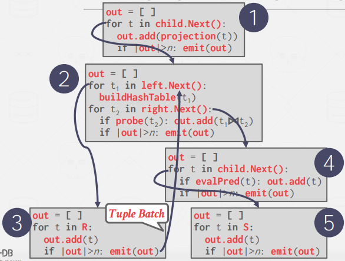

`Next()` with `batch`. The operator’s internal loop implementation is optimized for processing batches of data instead of a single item at a time. The size of the batch can vary based on hardware or query properties. 

## 2. Access Methods

An access method is how the DBMS accesses the data stored in a table. In general, there are two approaches to access models; data is either read from a table or from an index with a sequential scan.

### 2.1. Sequential Scan

Iterates over every page in the table and retrieves it from the buffer pool

#### Optimizations

These are dealt in other lecture

- Prefetching (L06): Fetch the next few pages in advance so that the DBMS does not have to block on storage I/O when accessing each page.
- Buffer Pool Bypass (L06): The scan operator stores pages that it fetches from disk in its local memory instead of the buffer pool in order to avoid sequential flooding.
- Parallelization (L13): Execute the scan using multiple threads/processes in parallel.
- Late Materialization (L11): DSM DBMSs can delay stitching together tuples until the upper parts of the
query plan. This allows each operator to pass the minimal amount of information needed to the next
operator (e.g. record ID, offset to record in column). This is only useful in column-store systems.
- Heap Clustering (L08): Tuples are stored in the heap pages using an order specified by a clustering index.

These are focused in this lecture

- Approximate Queries (Lossy Data Skipping): Execute queries on a sampled subset of the entire
table to produce approximate results. This is typically done for computing aggregations in a scenario
that allow a low error to produce a nearly accurate answer.
- Zone Map (Lossless Data Skipping): Pre-compute aggregations for each tuple attribute in a page.
The DBMS can then decide whether it needs to access a page by checking its Zone Map first. The
Zone Maps for each page are stored in separate pages and there are typically multiple entries in each
Zone Map page. Thus, it is possible to reduce the total number of pages examined in a sequential
scan. Zone maps are particularly valuable in the cloud database systems where data transfer over a
network incurs a bigger cost. See Figure 4 for an example of a Zone Map.

### 2.2. Index Scan

In an index scan, the DBMS picks an index to find the tuples that a query needs.

It depends whether to use which index or not.

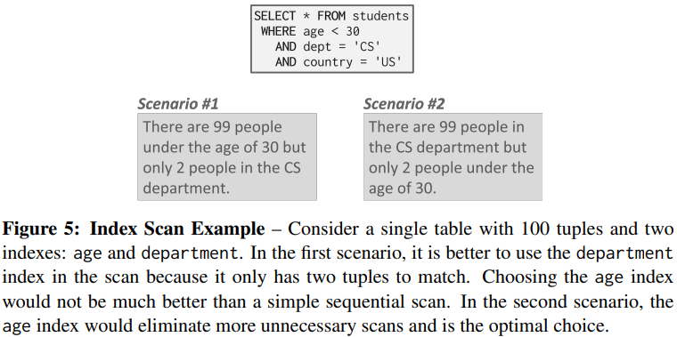

## 3. Modification Queries

Operators that modify the database (INSERT, UPDATE, DELETE) are responsible for checking constraints and
updating indexes. For UPDATE/DELETE, child operators pass Record IDs for target tuples and must keep track
of previously seen tuples. (Halloween Problem)

## 4. Expression Evaluation

The DBMS represents a WHERE clause as an expression tree (see Figure 7 for an example). The nodes in the
tree represent different expression types.

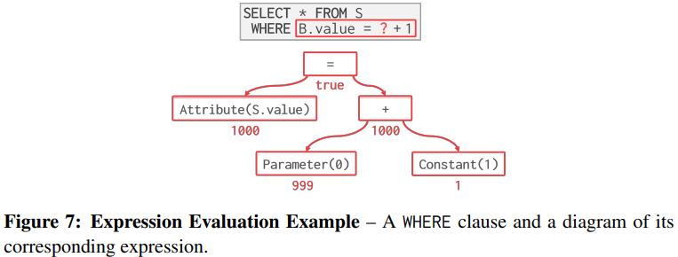

Evaluating predicates in this manner is slow because the DBMS must traverse the entire tree and determine
the correct action to take for each operator. A better approach is to just evaluate the expression directly (think
JIT compilation). Based on a internal cost model, the DBMS would determine whether code generation will
be adopted to accelerate a query.

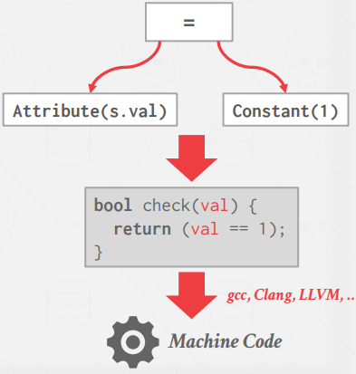

# Lecture 13. Query Execution 2

This lecture deals with multiple workers.

## 1. Process Models

There are two major process models that a DBMS may adopt: process per worker and thread per worker. A
third common database usage pattern takes an embedded approach.

### 1.1. Process per Worker

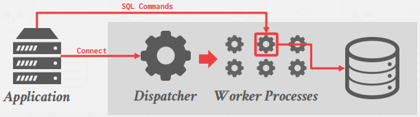

The most basic approach is process per worker. Here, each worker is a separate OS process, and thus
relies on OS scheduler. An application sends a request and opens a connection to the databases system.
Some dispatcher receives the request selects one of its worker processes to manage the connection. The
application now communicates directly with the worker who is responsible for executing the request that the
query wants.

Relying on the operating system for scheduling effectively reduces the DBMS’s control over execution.
Further, this model depends on shared memory to maintain global data structures or relies on message
passing, which has higher overhead.

An advantage of the process per worker approach is that a process crash doesn’t disrupt the whole system
because each worker runs in the context of its own OS process.

### 1.2. Thread per Worker

Almost every DBMS created in the last 20 years

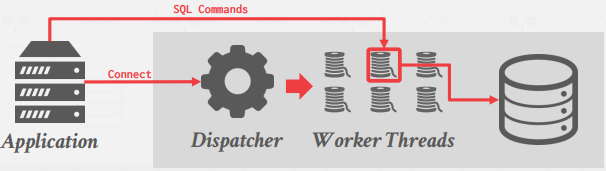

The most common model nowadays is thread per worker. Instead of having different processes doing
different tasks, each database system has only one process with multiple worker threads. In this environment,
the DBMS has full control over the tasks and threads, it can manage it own scheduling. The multi-threaded
model may or may not use a dispatcher thread.

Using multi-threaded architecture provides certain advantages. For one, there is less overhead per context
switch. Additionally, a shared model does not have to be maintained. However, the thread per worker model
does not necessarily imply that the DBMS supports intra-query parallelism.

### 1.3. Embedded DBMS

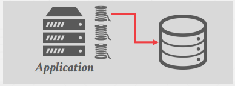

Runs DBMS in the same address space of the application, as opposed to a client-server model where the database stands independent of the application. In this scenario, the application will set up the threads and tasks to run on the database system. The application itself will largely be responsible for scheduling. (DuckDB, SQLite, and RocksDB)

## 2. Inter Query Parallelism

If the queries are read-only, then little coordination is required between queries. However, if multiple queries
are updating the database concurrently, more complicated conflicts arise. These issues are discussed further
in lecture 15. (`Transaction ACID`)

## 3. Intra-Query Parallelism

In intra-query parallelism, the DBMS executes the operations of a `single query in parallel`. This decreases latency for long-running queries.

The organization of intra-query parallelism can be thought of in terms of a producer/consumer paradigm. Each operator is a producer of data as well as a consumer of data from some operator running below it.

### 3.1. Intra-Operator Parallelism (Horizontal)

Operators are decomposed into independent fragments that perform the same function on different (disjoint) subsets of data.

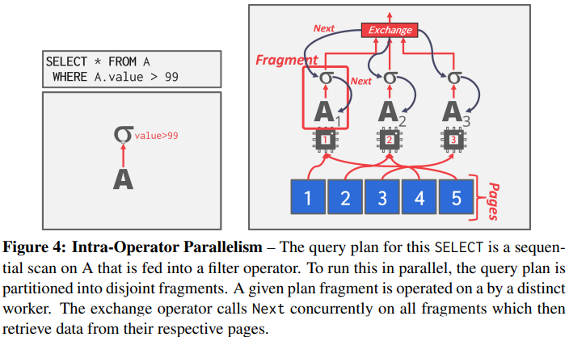

In general, there are three types of exchange operators:

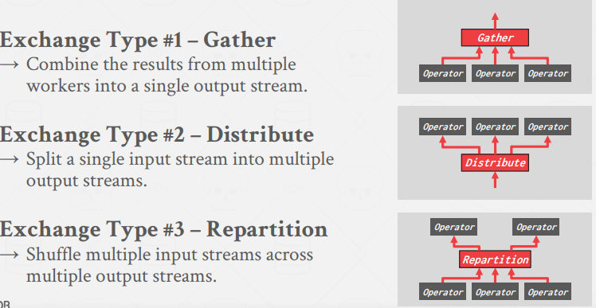

### 3.2. Inter-Operator Parallelism (Vertical)

In inter-operator parallelism, the DBMS overlaps operators in order to pipeline data from one stage to the next without materialization. This is sometimes called `pipelined parallelism`. (seems like stream processing)

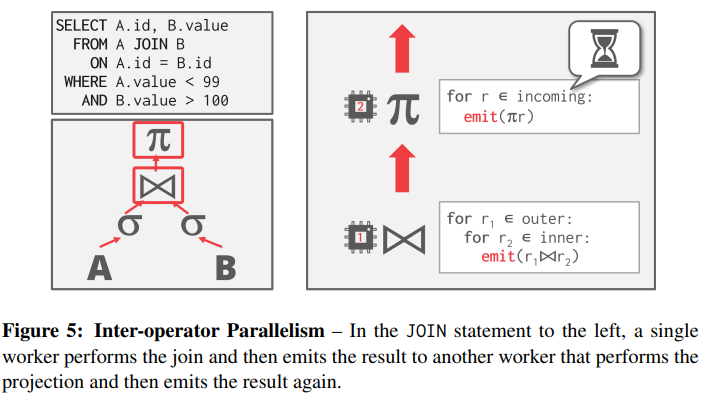

### 3.3. Intra + Inter Parallelism (Bushy Parallelism)

Bushy parallelism is a hybrid of intra-operator and inter-operator parallelism where workers execute multiple operators from different segments of the query plan at the same time.

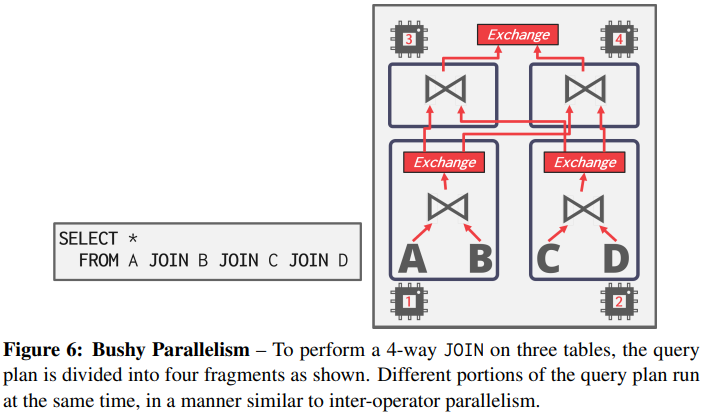

## I/O Parallelism

Using additional processes/threads to execute queries in parallel will not improve performance if the disk is always the main bottleneck.  Therefore, it is important to be able to split a database across multiple storage devices.

- Multi-Disk Parallelism: Storage Appliances / RAID
- Database Partitioning: the database is split up into disjoint subsets that can be assigned to discrete disks. Some DBMSs allow for specification of the disk location of each individual database.

