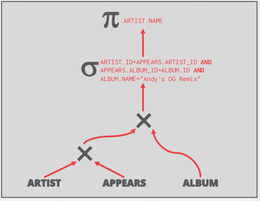

# Lecture 14. Query Planning & Optimization

Because SQL is declarative, the query only tells the DBMS what to compute, but not how to compute
it. The job of the DBMS’s optimizer is to pick an optimal plan for any
given query.

- Logical Plan: The optimizer generates a mapping of a logical algebra expression to the optimal equivalent physical algebra expression. The logical plan is roughly equivalent to the `relational algebra expressions` in the query 
  
  -> Heuristics / Rules

- Physical Plan: Physical operators define a specific execution strategy using an access path for the different operators in the query plan. Physical plans may depend on the physical format of the data that is processed (i.e. sorting, compression).
  
  -> Cost-based Search

<p align="center">
    
</p>

## 1. Logical Query Optimization

Rewrite the query to remove stupid / inefficient things. These techniques may need to examine catalog, but they
do not need to examine data.

example:

```sql
SELECT ARTIST.NAME
    FROM ARTIST, APPEARS, ALBUM
        WHERE ARTIST.ID=APPEARS.ARTIST_ID
            AND APPEARS.ALBUM_ID=ALBUM.ID
            AND ALBUM.NAME="Andy's OG Remix"
```

<p align="center">
    
</p>

### 1.1. Split Conjunctive Predicates

Decompose predicates into their simplest forms to make it easier for the optimizer to move them around. (This is not optimization. It's just preparation for future optimization)

<p align="center">
    
</p>

### 1.2. Predicate Pushdown

Project out all attributes except the ones requested or requires. Move the predicate to the lowest
applicable point in the plan.

<p align="center">
    
</p>

### 1.3. Replace Cartesian Products with Joins

Replace all Cartesian Products with inner joins using the join predicates.

<p align="center">
    
</p>

### 1.4. Projection Pushdown

Perform projections as early as possible

<p align="center">
    
</p>

### 1.5. Others

#### 1.5.1. Nested Sub-Queries: rewrite

Re-write the query by de-correlating and / or flattening it. 


#### 1.5.2. Decomposing Queries

Decompose the nested query and store the result to a temporary table.


#### 1.5.3. Expression Rewriting

An optimizer transforms a query's expressions (e.g., WHERE/ON clause predicates) into the minimal set of expressions.


## 2. Physical Query Optimization

Use a model to estimate the cost of executing a plan. Enumerate multiple equivalent plans for a query and pick
the one with the lowest cost. But exhaustive enumeration of all valid plans for a query is much too slow for an optimizer to perform. For joins alone, which are commutative and associative, there are $4^n$ different orderings of every n-way join. Optimizers must limit their search space in order to work efficiently.

### 2.1. Cost Estimation

The DBMS uses a cost model to predict the behavior of a query plan given a database state. The cost of a query depends on several underlying metrics, including:
- CPU: small cost, but tough to estimate.
- Disk I/O: the number of block transfers. (Logical Cost)
- Memory: the amount of DRAM used.

### 2.2. Statistics

To approximate costs of queries, DBMS’s maintain internal statistics about tables, attributes, and indexes in
their internal catalogs.

For each relation $R$, the DBMS maintains the following information:

- $N_R$: Number of tuples in R
- $V(A, R)$: Number of distinct values of attribute $A$

If data is uniform, `selection cardinality` $SC(A, R) = N_R/V(A, R)$. This assumption is often incorrect, but it simplifies the optimization process.

#### 2.2.1. Selection Statistics

The selectivity (sel) of a predicate P is the fraction of tuples that qualify. The formula used to compute selective depends on the type of predicate. Selectivity for complex predicates is hard to estimate accurately which
can pose a problem for certain systems.

<p align="center">
    
</p>

In computing the selection cardinality of predicates, the following three assumptions are used.

- Uniform Data: The distribution of values (except for the heavy hitters) is the same.
- Independent Predicates: The predicates on attributes are independent.
- Inclusion Principle: The domain of join keys overlap such that each key in the inner relation will also exist in the outer table.

#### 2.2.2. Statistics: Histograms

Maintain an occurrence count per value (or range of values) in a column

<p align="center">
    
    
</p>

#### 2.2.3. Statistics: Sketches

Probabilistic data structure that gives an approximate count for a given value.

#### 2.2.4. Statistics: Sampling

DBMS maintains a small subset of each table that it then uses to evaluate expressions to compute selectivity.


## 3. Multi Relation Query Plan Example

For single-relation query plans, the biggest obstacle is choosing the best access method (i.e., sequential scan,
binary search, index scan, etc.) Most new database systems just use heuristics, instead of a sophisticated
cost model, to pick an access method. `sargable (Search Argument Able)`

For Multi-Relation query plans, as number of joins increases, the number of alternative plans grow rapidly.
Consequently, it is important to restrict the search space so as to be able to find the optimal plan in a
reasonable amount of time. There are two ways to approach this search problem:

- Bottom-up
- Top-down

### 3.1. Bottom-up Example: System R

Use static rules to perform initial optimization. Then use dynamic programming to determine the best join
order for tables using a divide-and conquer search method.

<p align="center">
    
    
    
    
</p>
<p align="center">

</p>

### 3.2. Top-down Example: Volcano

Start with a logical plan of what we want the query to be. Perform a branch-and-bound search to traverse
the plan tree by converting logical operators into physical operators. Keep track of global best plan during search. Treat physical properties of data as first-class entities during planning.

(SEE SLIDE)


