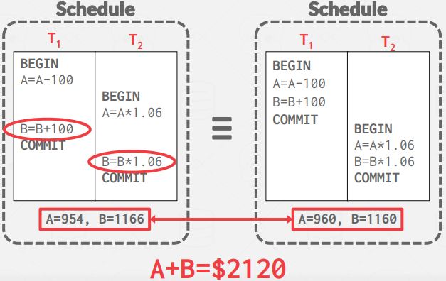
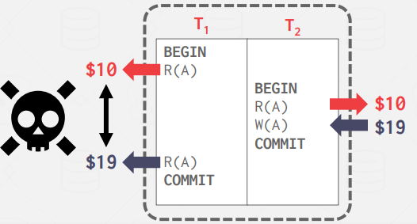
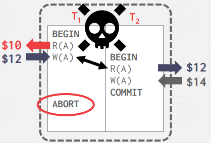
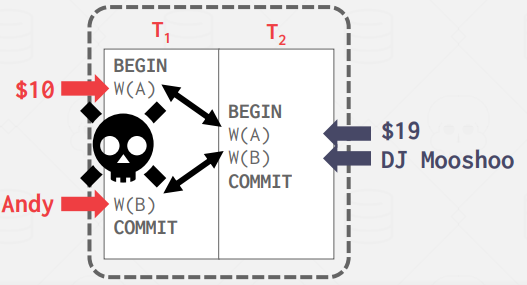
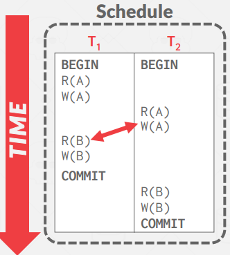
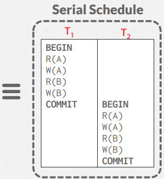
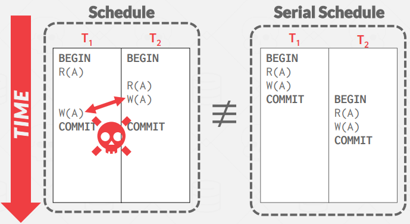
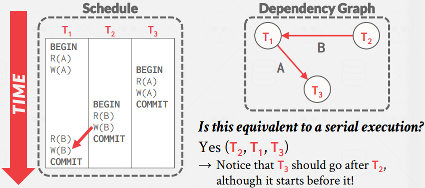
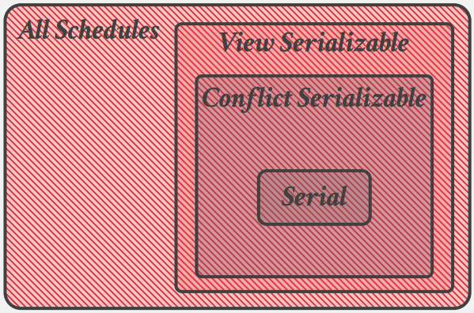

# Lecture 15. Concurrency Control Theory

- Lost Update Problem (Concurrency Control): How can we avoid race conditions when updating records at the same time?
- Durability Problem (Recovery): How can we ensure the correct state in case of a power failure?

The DBMS is only concerned about what data is read/written from/to the database. Changes to the "outside world" are beyond the scope of the DBMS.

- Database: A fixed set of named data objects (A, B, C, ...)
- Transaction: A sequence of read and write operations (R(A), W(B), ...)
  - A new txn starts with the BEGIN command.
  - The txn stops with either COMMIT or ABORT
    - If commit, the DBMS either saves all the txn's changes or aborts it.
    - If abort, all changes are undone so that it's like as if the txn never executed at all.

The criteria used to ensure the correctness of a database is given by the acronym `ACID`

## 1. Atomicity

### 1.1. Approach #1: Logging

DBMS logs all actions so that it can undo the actions of aborted transactions. It maintains undo records both
in memory and on disk. Logging is used by almost all modern systems for audit and efficiency reasons.

### 1.2. Approach #2: Shadow Paging

The DBMS makes copies of pages modified by the transactions and transactions make changes to those
copies. Only when the transaction commits is the page made visible. This approach is typically slower at
runtime than a logging-based DBMS. Rarely used. (CouchDB, LMDB)

## 2. Consistency

- Database Consistency: The database accurately represents the real world entity it is modeling and follows
integrity constraints. (E.g. The age of a person cannot not be negative). Additionally, transactions in the
future should see the effects of transactions committed in the past inside of the database.
- Transaction Consistency: If the database is consistent before the transaction starts, it will also be consistent 
after. Ensuring transaction consistency is the application’s responsibility. (Transaction consistency is the application's responsibility)

## 3. Isolation

Users submit txns, and each txn executes as if it was running by itself. But the DBMS achieves concurrency by
interleaving the actions (reads/writes of DB objects) of txns. We need a way to interleave txns but still make it appear as if they ran one-at-a-time.

### 3.1. Concurrency Control

There are two categories of concurrency control protocols:
- Pessimistic: The DBMS assumes that transactions will conflict, so it doesn’t let problems arise in the
first place.
- Optimistic: The DBMS assumes that conflicts between transactions are rare, so it chooses to deal
with conflicts when they happen after the transactions commit.

### 3.1.1. Serializability

We want to interleave transactions to maximize concurrency while ensuring that the output is “correct”. The goal of a concurrency control protocol is to generate an execution schedule that is is equivalent to some serial execution:

- Serial Schedule: Schedule that does not interleave the actions of different transactions.
- Equivalent Schedules: For any database state, if the effect of execution the first schedule is identical
to the effect of executing the second schedule, the two schedules are equivalent.
- Serializable Schedule: A serializable schedule is a schedule that is equivalent to any serial execution
of the transactions. Different serial executions can produce different results, but all are considered
“correct”.

    

Of course, we don't determine if transaction is 'serializable' in runtime. Using this, we'll construct algorithms to deal concurrency.

### 3.1.2. Conflict Serializability

A conflict between two operations occurs if the operations are for different transactions, they are performed
on the same object, and at least one of the operations is a write.

- Read-Write Conflicts (`Unrepeatable Reads`): A transaction is not able to get the same value when
reading the same object multiple times. 

- Write-Read Conflicts (`Dirty Reads`): A transaction sees the write effects of a different transaction
before that transaction committed its changes.

- Write-Write conflict (`Lost Updates`): One transaction overwrites the uncommitted data of another
concurrent transaction.

Two schedules are `conflict equivalent` iff they involve the same operations of the same transactions and
every pair of conflicting operations is ordered in the same way in both schedules. A schedule $S$ is conflict
serializable if it is conflict equivalent to some serial schedule.

Swapping operations is easy when there are only two txns in the schedule. It's cumbersome when there are many txns.
Are there any faster algorithms to figure this out other than transposing operations?

In a `dependency graph`, each transaction is a node in the graph. There exists a directed edge from node $T_i$
to $T_j$ iff an operation $O_i$ from $T_i$ conflicts with an operation $O_j$ from $T_j$ and $O_i$ occurs before $O_j$ in the schedule. Then, a schedule is conflict serializable iff the dependency graph is acyclic.

### 3.1.3. View Serializability

View serializability is a weaker notion of serializibility that allows for all schedules that are conflict serializable and “blind writes” (i.e. performing writes without reading the value first). Thus, it allows for more
schedules than conflict serializability, but is difficult to enforce efficiently. This is because the DBMS does
not know how the application will “interpret” values.

## 4. Durability

All of the changes of committed transactions must be durable (i.e., persistent) after a crash or restart. The
DBMS can either use logging or shadow paging to ensure that all changes are durable.
