# Lecture 16. Two-Phase Locking

<p align="center">
    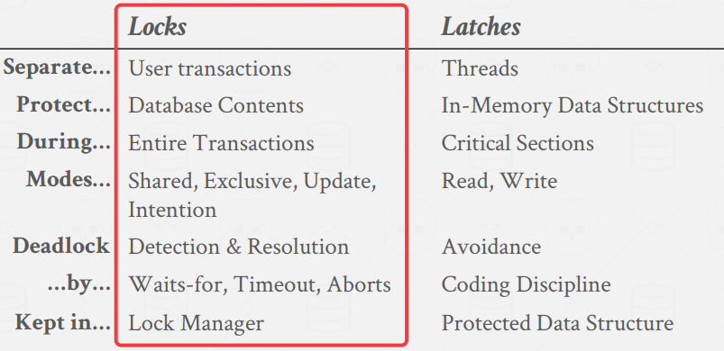
</p>

A DBMS uses locks to dynamically generate an execution schedule for transactions that is serializable without knowing each transaction’s read/write set ahead of time. The DBMS contains a centralized `lock manager` that decides whether a transaction can acquire a lock or not. There are two basic types of locks:

- Shared Lock (S-LOCK): A shared lock that allows multiple transactions to read the same object at the
same time. If one transaction holds a shared lock, then another transaction can also acquire that same
shared lock.
- Exclusive Lock (X-LOCK): An exclusive lock allows a transaction to modify an object. This lock
prevents other transactions from taking any other lock (S-LOCK or X-LOCK) on the object. Only one
transaction can hold an exclusive lock at a time.

<p align="center">
    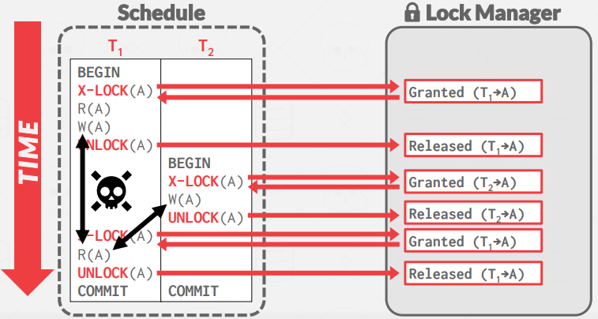
</p>

If we use lock as usual, RW conflict(`Unrepeatable Reads`) can occur. We need some kind of protocol to prevent that.

## 1. 2PL

Two-Phase locking (2PL) is a `pessimistic` (optimistic for L17) concurrency control protocol that uses locks to determine whether
a transaction is allowed to access an object in the database on the fly. The protocol does not need to know
all of the queries that a transaction will execute ahead of time.

- Phase #1– Growing: In the growing phase, each transaction requests the locks that it needs from the
DBMS’s lock manager. The lock manager grants/denies these lock requests.
- Phase #2– Shrinking: Transactions enter the shrinking phase immediately after it releases its first lock. In
the shrinking phase, transactions are only allowed to release locks. They are not allowed to acquire new
ones.

<p align="center">
    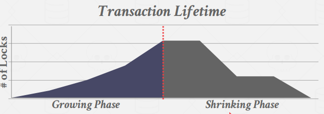
    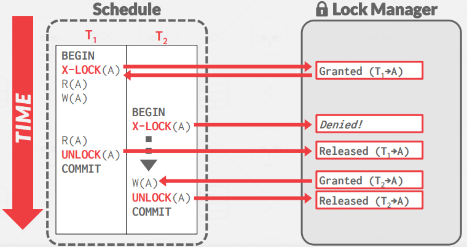
</p>

- But it is subject to `cascading aborts`: Strong Strict 2PL will prevent this (with performance degradation, section 2)
- May have WR conflict(`dirty read`): Strong Strict 2PL will prevent this (with performance degradation, section 2)
- May lead to `deadlocks`: Detection & Prevention will handle this (section 3)

<p align="center">
    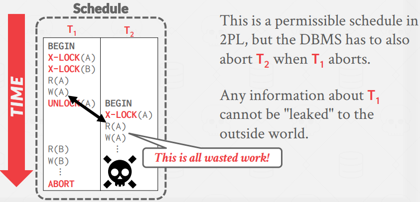
</p>

## 2. Strong Strict 2PL

(aka Rigorous 2PL) 

A schedule is strict if any value written by a transaction is never read or overwritten by another transaction
until the first transaction commits. Strong Strict 2PL (also known as Rigorous 2PL) is a variant of 2PL where
the transactions only release locks when they commit.

<p align="center">
    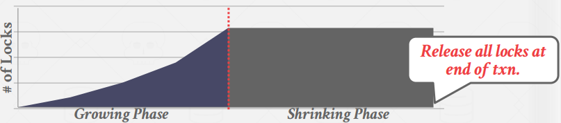
</p>

The advantage of this approach is that the DBMS does not incur cascading aborts. The DBMS can also
reverse the changes of an aborted transaction by restoring the original values of modified tuples. However,
Strict 2PL generates more cautious/pessimistic schedules that limit concurrency.

<p align="center">
    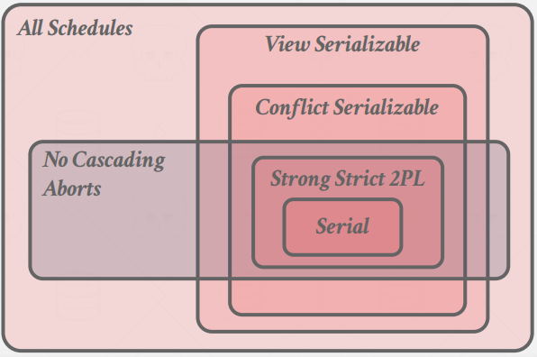
</p>

- May lead to `deadlocks`: Detection & Prevention will handle this (section 3)

## 3. Deadlock Handling

If $T_1$ X-Locks A, $T_2$ X-Locks B, and $T_1$ tries to X-Locks B, $T_2$ tries to X-Locks A, deadlock happens. 

### 3.1. Deadlock Detection (and kill/restart)

To detect deadlocks, the DBMS creates a waits-for graph where transactions are nodes, and there exists a
directed edge from $T_i$ to $T_j$ if transaction $T_i$ is waiting for transaction $T_j$ to release a lock. The system will periodically check for cycles in the waits-for graph (usually with a background thread) and then make a decision on how to break it.

Note that there is a tradeoff between the frequency of deadlock checks (uses cpu cycles) and the wait time till a deadlock is broken.

<p align="center">
    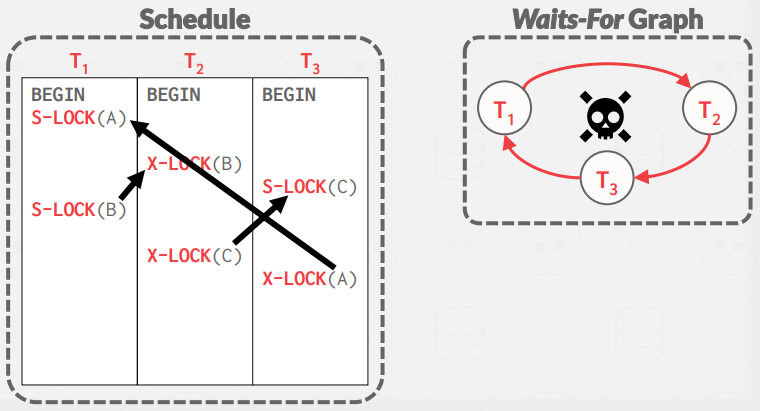
</p>

The DBMS can consider multiple transaction properties when selecting a victim to break the deadlock (age, progress, # of items locked, # of transactions needed to rollback, # of times a transaction has been restarted)

### 3.2. Deadlock Prevention

Instead of letting transactions try to acquire any lock they need and then deal with deadlocks afterwards, deadlock prevention 2PL stops transactions from causing deadlocks before they occur. When a transaction tries to acquire a lock held by another transaction (which could cause a deadlock), the DBMS kills one of them.

- `Wait-Die` ("higher priority waits"): If the requesting transaction has a higher priority than the holding transaction, it waits. Otherwise, it aborts.
- `Wound-Wait` ("higher priority kills"): If the requesting transaction has a higher priority than the
holding transaction, the holding transaction aborts and releases the lock. Otherwise, the requesting
transaction waits.

<p align="center">
    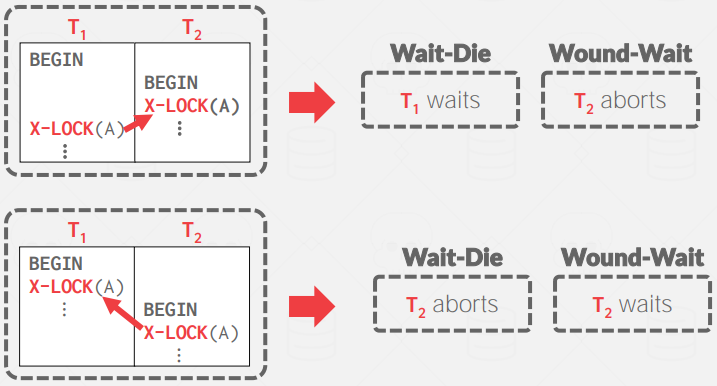
</p>

Since only one type of direction is allowed, this can guarantee no deadlocks. When a txn restarts, its original timestamp is used for priority to prevent starvation. (small timestamp = higher priority)

## 4. Lock Granularities

When a transaction acquires a lock for an object in this hierarchy, it implicitly acquires the locks for all its children objects.

<p align="center">
    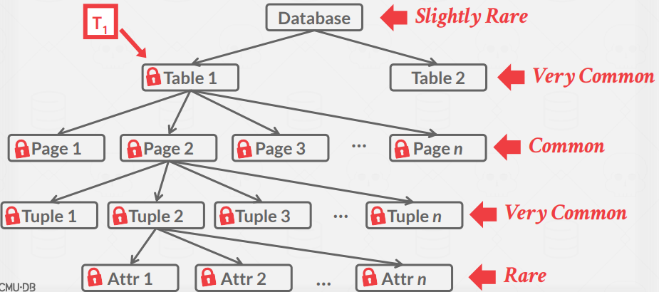
</p>

`Intention locks` allow a higher level node to be locked in shared mode or exclusive mode without having to
check all descendant nodes. If a node is in an intention mode, then explicit locking is being done at a lower
level in the tree. This makes a lock manager to check if a lock for lower level is possible as early as possible.

- Intention-Shared (IS): Indicates explicit locking at a lower level with shared locks.
- Intention-Exclusive (IX): Indicates explicit locking at a lower level with exclusive or shared locks.
- Shared+Intention-Exclusive (SIX): The sub-tree rooted at that node is locked explicitly in shared mode and explicit locking is being done at a lower level with exclusive-mode locks.

<p align="center">
    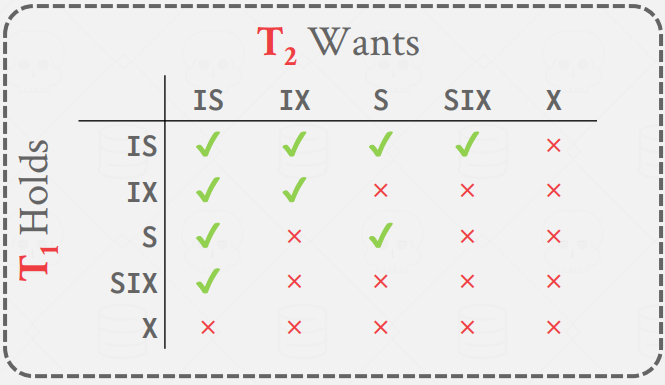
</p>

- To get $S$ or $IS$ lock on a node, the txn must hold at least $IS$ on parent node.
- To get $X$, $IX$, or $SIX$ on a node, must hold at least $IX$ on parent node.

```sql
SELECT * FROM <table>
    WHERE <...> FOR UPDATE; -- Perform a select and then sets an exclusive lock on the matching tuples.
```
