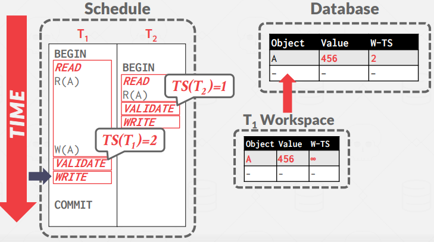
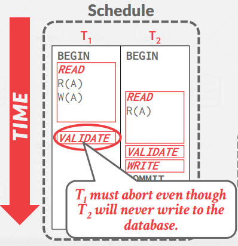
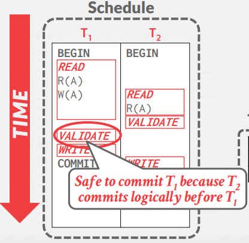
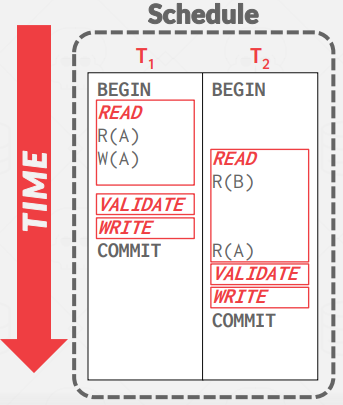
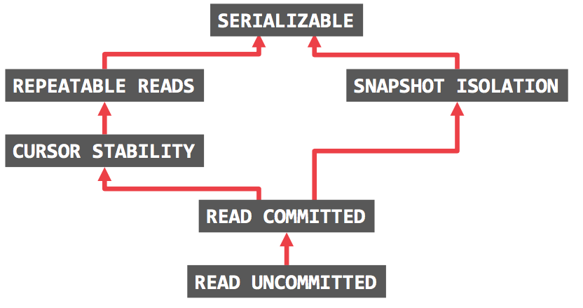

# Lecture 17. Time Stamp Ordering

Each transaction $T_i$ is assigned a unique fixed timestamp $TS(T_i)$ that is monotonically increasing. Different schemes assign timestamps at different times during the transaction. Time stamp ordering follows:

If $TS(T_i) < TS(T_j)$, then the DBMS must ensure that the execution schedule is equivalent to the serial schedule where $T_i$ appears before $T_j$.

## 1. Basic Timestamp Ordering (BASIC T/O)

This is not optimistic concurrency control. Timestamp here is `BEGIN` of transaction. To implement this scheme, we associate with each data item $Q$ two timestamp values:

- $W-TS(X)$: Write timestamp on object $X$
- $R-TS(X)$: Read timestamp on object $X$

For $read(X)$,
```
BEGIN T_i

// T_i tries to read X
if TS(T_i) < W-TS(X):                   // cannot read future-written object
    abort T_i  
    re-try T_i with new timestamp
else:                                   // ok to read
    allow T_i to read X
    R-TS(X) <- max(R-TS(X), TS(T_i))
    X_COPY <- X                         // for repeatable read for T_i
```
 
For $write(X)$,
```
BEGIN T_i

// T_i tries to write X
if TS(T_i) < W-TS(X) or TS(T_i) < R-TS(X):  // cannot overwrite future-referenced object
    abort T_i  
    re-try T_i with new timestamp
else:                                       // ok to write
    allow T_i to write X
    W-TS(X) <- TS(T_i)
    X_COPY <- x                             // for repeatable read for T_i
```

- Pros: Conflict-serializable
- Cons: Possible starvation of long txn. Copy/ts overhead. Can permit non-recoverable txn. (several ways to make recoverable: see Chapyer 18.5)


### 1.1. Optimization: Thomas Write Rule

For $write(X)$,
```
BEGIN T_i

// T_i tries to write X
if TS(T_i) < R-TS(X):                       // cannot overwrite future-read object
    abort T_i  
    re-try T_i with new timestamp
elif TS(T_i) < W-TS(X):                     // no other txn reads this write, so we can ignore (violates ts order)
    ignore write and continue
else:                                       // ok to write
    allow T_i to write X
    W-TS(X) <- TS(T_i)
    X_COPY <- x                             // for repeatable read for T_i
```

## 2. Optimistic Concurrency Control (OCC)

See Validation-Based Protocol in chapter 18.6.

This is `optimistic` concurrency control. Timestamp here is roughly end ($ValidationTS$) of transaction. OCC works best when the number of conflicts is low. In OCC, the DBMS creates a `private workspace` for each transaction. All modifications of the transaction are applied to this workspace. Any object read is copied into workspace and any object written is copied to the workspace and modified there. No other transaction can read the changes made by another transaction in its private workspace. When a transaction commits, the DBMS compares the transaction’s workspace write set to see whether it conflicts with other transactions. If there are no conflicts, the write set is installed into the "global" database.

OCC consists of three phases:
1. `Read Phase`: Here, the DBMS tracks the read/write sets of transactions and stores their writes in a private workspace.
   
    -> $StartTS(T_i)$: the time when $T_i$ started its execution.
2. `Validation Phase`: When a transaction commits, the DBMS checks whether it conflicts with other transactions.

    -> $ValidationTS(T_i)$: the time when $T_i$ started its validation phase.
3. `Write Phase`: If validation succeeds, the DBMS applies the private workspace changes to the database. Otherwise, it aborts and restarts the transaction.

    -> $WriteTS(T_i)$: the time when $T_i$ start its write phase.
    -> $FinishTS(T_i)$: the time when $T_i$ finished its write phase.

### 2.1. OCC - Validation Phase

To ensure `only serializable` schedules are permitted, DBMS checks RW/WW conflicts in one way:
- Backward validation (from younger transactions to older transactions)
- Forward validation (from older transactions to younger transactions)

Here we describe forward validation. The DBMS checks the timestamp ordering of the committing transaction with all other running transactions. Transactions that have not yet entered the validation phase are assigned a timestamp of $\infty$.

If $ValidationTS(T_i) < ValidationTS(T_j)$, then one of the following three conditions must hold:
1. $T_i$ completes all three phases before $Tj$ begins its execution.

    i.e. $FinishTS(T_i) < StartTS(T_j)$
2. $T_i$ completes before $T_j$ starts its Write phase, and $T_i$ does not write to any object read by $T_j$.

    i.e. $FinishTS(T_i) < WriteTS(T_j)$ &nbsp; and &nbsp; $WriteSet(T_i) ∩ ReadSet(T_j) = ∅$
3. $T_i$ completes its Read phase before $T_j$ completes its Read phase, and $T_i$ does not write to any object
that is either read or written by $T_j$. 

    i.e. $WriteSet(T_i) ∩ ReadSet(T_j) = ∅$ &nbsp; and &nbsp; $WriteSet(T_i) ∩ WriteSet(T_j) = ∅$.


Example:



Since $TS(T_2) = 1$, $T_2$ commit was successful. $T_1$ commits successfully by condition 2.





For mid-side, condition 3 holds. For right-side, works fine for all.


- Pros: Only serializable
- Cons: Private workspace/Validation phase/Write phase/timestamp overhead. Abort are potentially more wasteful than in other protocols because they only occur after a transaction has already executed.

## 3. Isolation Levels

Serializability is useful because it allows programmers to ignore concurrency issues but enforcing it may allow too little parallelism and limit performance. We may want to use a weaker level of consistency to improve scalability.

Isolation levels control the extent that a transaction is exposed to the actions of other concurrent transactions.

Anomalies:
- `Dirty Read`: Reading uncommitted data. (WR conflict)
- `Unrepeatable Reads`: Redoing a read results in a different result. (RW conflict)
- `Phantom Reads`: Insertion or deletions result in different results for the same range scan queries.

Isolation Levels (Strongest to Weakest):
1. `SERIALIZABLE`: No Phantoms, all reads repeatable, and no dirty reads.
2. `REPEATABLE READS`: Phantoms may happen.
3. `READ-COMMITTED`: Phantoms and unrepeatable reads may happen.
4. `READ-UNCOMMITTED`: All anomalies may happen.

The isolation levels defined as part of SQL-92 standard only focused on anomalies that can occur in a 2PL-based DBMS. There are two additional isolation levels:
1. `CURSOR STABILITY`
   - Between repeatable reads and read committed
   - Prevents Lost Update Anomaly.
   - Default isolation level in IBM DB2.
2. `SNAPSHOT ISOLATION`
   - Guarantees that all reads made in a transaction see a consistent snapshot of the database that existed at the time the transaction started.
   - A transaction will commit only if its writes do not conflict with any concurrent updates made since that snapshot.
   - Susceptible to write skew anomaly.




