# Lecture 18. Multi Version Concurrency Control

Multi-Version Concurrency Control (MVCC) is a larger concept than just a concurrency control protocol. It involves all aspects of the DBMS’s design and implementation. 

With MVCC, the DBMS maintains `multiple physical versions` of a single logical object in the database. When a transaction writes to an object, the DBMS creates a new version of that object. When a transaction reads an object, it reads the newest version that existed when the transaction started.

=> writers do not block writers and readers do not block readers

=> read-only transactions can read a consistent snapshot of the database without using locks of any kind (& time-travel queries)

example1:

    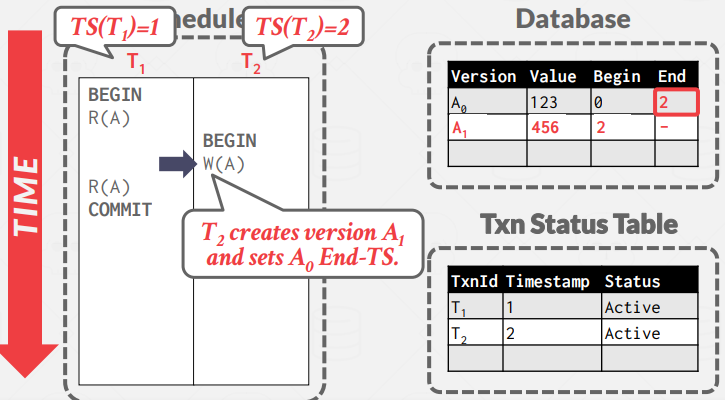 
    

example2:

    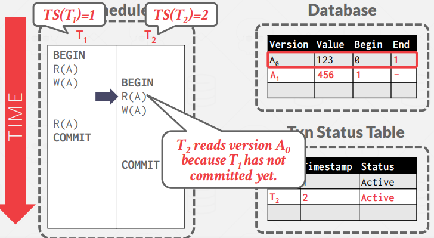 
    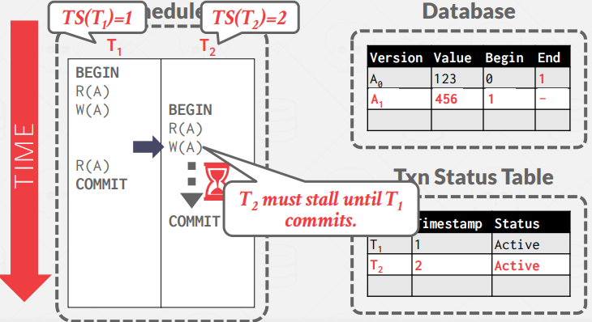

There are four important MVCC design decisions:
1. Concurrency Control Protocol (L16~17, slightly modified)
2. Version Storage
3. Garbage Collection
4. Index Management

## 1. Version Storage

This is how the DBMS will store the different physical versions of a logical object and how transactions find the newest version visible to them. The DBMS uses the tuple’s pointer field to create a `version chain` per logical tuple, which is essentially a `linked list` of versions sorted by timestamp.

**Indexes always point to the “head” of the chain**, which is either the newest or oldest version depending on implementation. A thread traverses chain until it finds the correct version. Different storage schemes determine where/what to store for each version.

### 1.1. Approach 1. Append-Only Storage

All physical versions of a logical tuple are stored in the same table space. Versions are mixed together in
the table and each update just appends a new version of the tuple into the table and updates the version
chain. The chain can either be sorted oldest-to-newest (O2N) which requires chain traversal on look-ups, or
newest-to-oldest (N2O), which requires updating index pointers for every new version.

O2N example:

    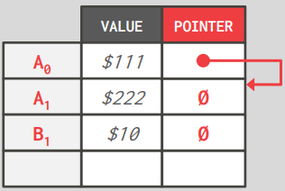 
    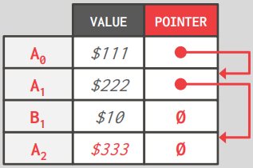

### 1.2. Approach 2. Time-Travel Storage

The DBMS maintains a separate table called the time-travel table which stores older versions of tuples.
On every update, the DBMS copies the old version of the tuple to the time-travel table and overwrites the
tuple in the main table with the new data. Pointers of tuples in the main table point to past versions in the
time-travel table.

example:

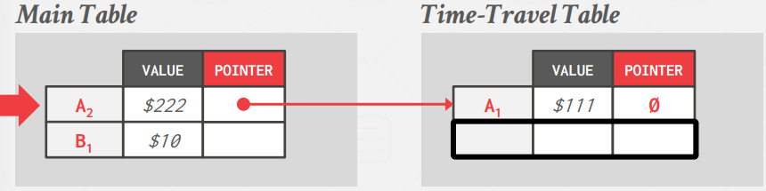 
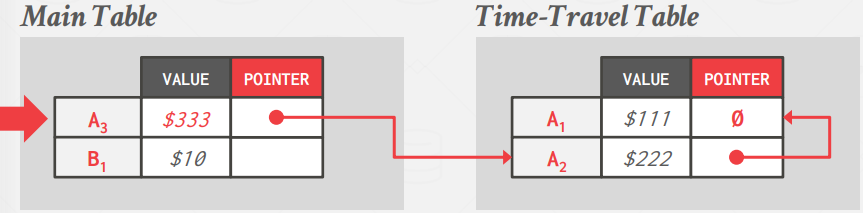

### 1.3. Approach 3. Delta Storage

Like time-travel storage, but instead of the entire past tuples, the DBMS only stores the deltas, or changes
between tuples in what is known as the delta storage segment. Transactions can recreate older versions by iterating through the deltas. This results in faster writes than time-travel storage but slower reads.

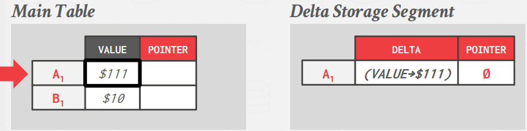
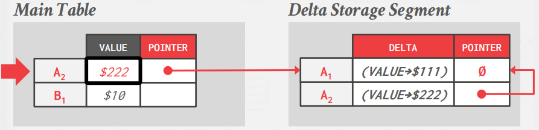
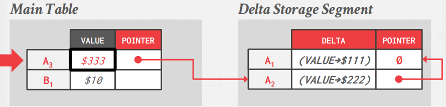

## 2. Garbage Collection

A version is reclaimable if:
- no active transaction can “see” that version(Snapshot Isolation) OR,
- it was created by a transaction that was aborted.

### 2.1. Approach 1. Tuple-level GC

With tuple-level garbage collection, the DBMS finds old versions by examining tuples directly.

- Background Vacuuming: Separate threads periodically scan the table and look for reclaimable versions. This works with any version storage scheme. A simple optimization is to maintain a “dirty page bitmap,” which keeps track of which pages have been modified since the last scan. This allows the threads to skip pages which have not changed.
- Cooperative Cleaning: Worker threads identify reclaimable versions as they traverse version chain. This only works with O2N chains.

### 2.2. Approach 2. Transaction-level GC

Each transaction is responsible for keeping track of their own old versions so the DBMS does not have to scan tuples. When a transaction completes, the garbage collector can use that to identify which tuples to reclaim. The DBMS determines when all versions created by a finished transaction are no longer visible.

## 3. Index Management

All primary key (pkey) indexes always point to version chain head. How often the DBMS has to update the pkey index depends on whether the system creates new versions when a tuple is updated. If a transaction updates a pkey attribute(s), then this is treated as a DELETE followed by an INSERT.

There are two approaches to handle secondary indexes.

### 3.1. Approach 1. Logical Pointers

The DBMS uses a fixed identifier per tuple that does not change. This requires an extra indirection layer that maps the logical id to the physical location of the tuple. Then, updates to tuples can just update the mapping in the indirection layer. (nobody does tuple mapping layer implementation.)

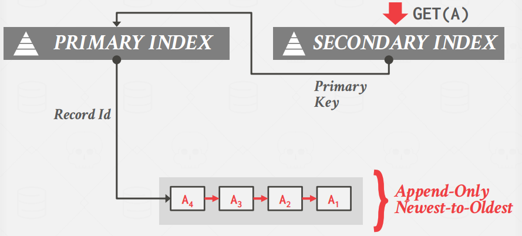
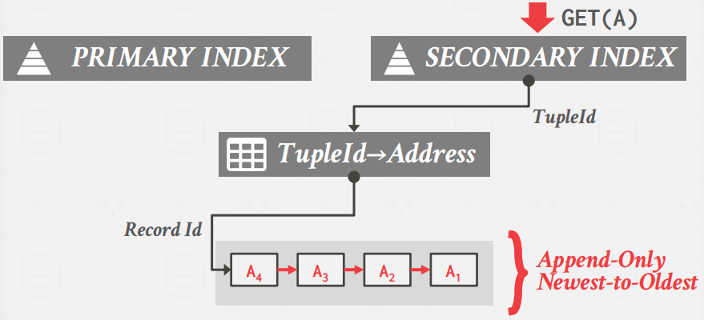

### 3.2. Approach 2. Physical Pointers

The DBMS uses the physical address to the version chain head. This requires updating every index when
the version chain head is updated.

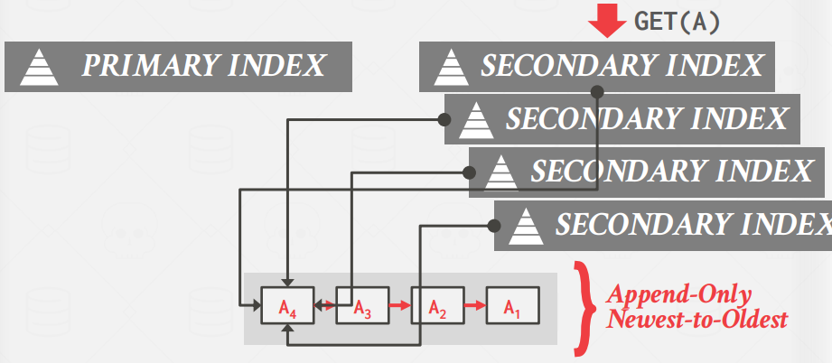

## 4. MVCC Implementations

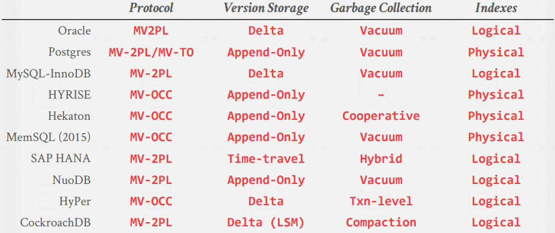

