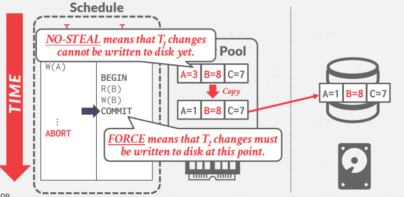
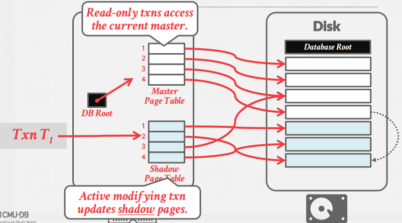
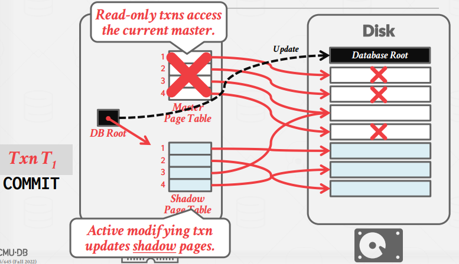
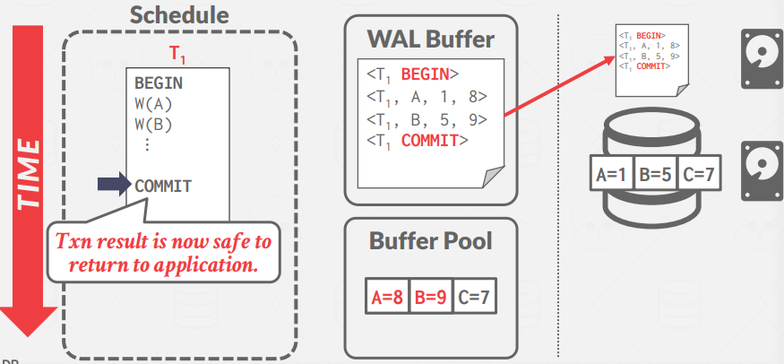
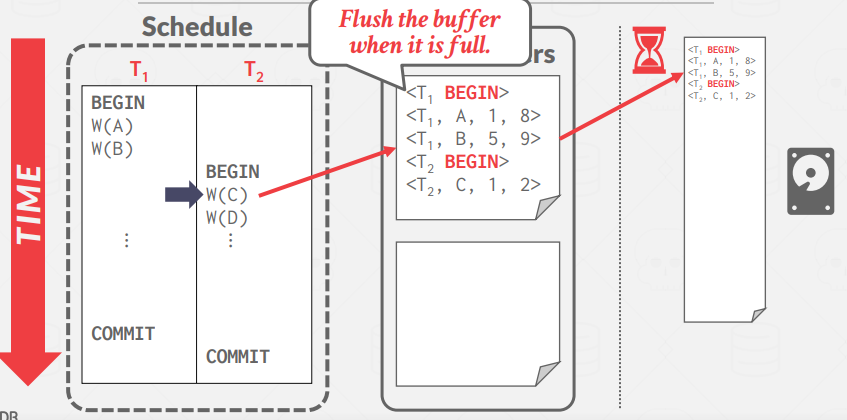
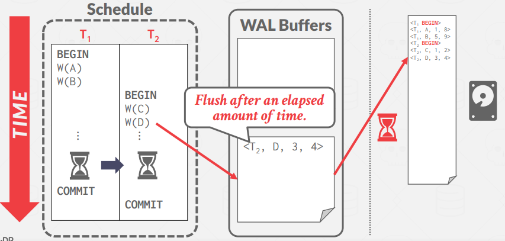
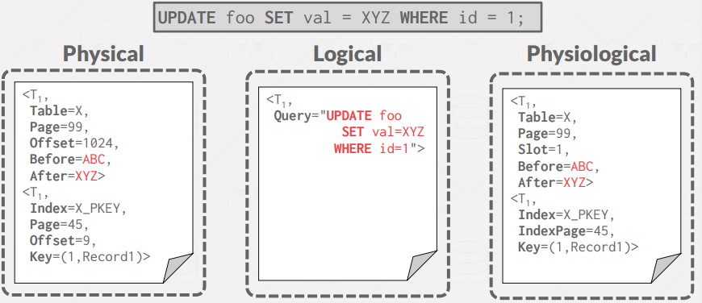

# Lecture 19. Database Logging

Recovery algorithms have two parts:
- Actions during normal txn processing to ensure that the DBMS can recover from a failure. (L19)
- Actions after a failure to recover the database to a state that ensures atomicity, consistency, and durability. (L20)

There are three types of storages. Volatile Storage(DRAM, SRAM) does not persist data after power loss or program exit. Non-volatile Storage(HDD, SSD) persists data after power loss and program exit, but cannot survive missile attack. Stable Storage is ideal, non-existent form of non-volatile storage that survives all possible failures, and we approximate this with multiple distributed storage devices.

To ensure database `consistency`, transaction `atomicity`, and `durability`, we need to make sure all the data in memory are well reflected to the non-volatile storage.

There are three types of failures:

- Type #1: Transaction Failures

    Transactions failures occur when a transaction reaches an error and must be aborted.

    Logical Errors(integrity, constraint violation), Internal State Errors(deadlock)

- Type #2: System Failures

    System failures are unintented failures in the underlying software or hardware that hosts the DBMS.

    Software Failure(uncaught divide-by-zero), Hardware Failure(power plug gets pulled)

- Type #3: Storage Media Failure (DBMS cannot handle this)

    Storage media failures are non-repairable failures that occur when the physical storage device is damaged.

The DBMS needs to ensure the following guarantees:
- The changes for any transaction are durable once the DBMS has told somebody that it committed.
- No partial changes are durable if the transaction aborted.

So we introduce following properties:

- STEAL: DBMS allows an uncommitted transaction to overwrite the most recent committed value of an object in non-volatile storage (can a transaction write uncommitted changes belonging to a different traansaction to disk? -> need undo / in mvcc, can i create new version?)
- FORCE:  DBMS requires that all updates made by a transaction are reflected on non-volatile storage before the transaction is allowed to commit (ie. return a commit message back to the client -> !force need redo)

## 1. NO-STEAL + FORCE

Because of the `FORCE` policy, when $T_2$ commits at Step #2, all of its changes must be written to disk. To do this, the DBMS makes a copy of the memory in disk, applies only the changes from $T_2$, and writes it back to disk. This is because `NO-STEAL` prevents the uncommitted changes from $T_1$ to be written to disk.

Pros: The easiest buffer pool management policy to implement (no undo/redo needed)

Cons: All of the data (ie. the write set) that a transaction needs to modify must fit into memory

### 1.1. Shadow Paging

Shadow Paging is an improvement upon the previous scheme. DBMS copies pages on write to create two versions:
- Master: Contains only changes from committed txns.
- Shadow: Temporary database with changes made from uncommitted txns.

Updates are only made in the shadow copy. When a transaction commits, the shadow copy is atomically switched to become the new master. The old master is eventually garbage collected.

     
    

1. The database root points to a master page table which in turn points to the pages on disk (all of which contain committed data). 
2. When an updating transaction occurs, a shadow page table is created that points to the same pages as the master. Modifications are made to a temporary space on disk and the shadow table is updated.
3. To complete the commit, the database root pointer is redirected to the shadow table, which becomes the new master.

Pros: Fast recovery time.

Cons: Slow runtime. Commits require the page table, and root, in addition to every updated page to be flushed. This causes fragmented data and also requires garbage collection. Another issue is that this `only supports one writer` transaction at a time or transactions in a batch.

## 2. STEAL + NO-FORCE

Almost every DBMS uses STEAL + NO-FORCE

### 2.1. Write-Ahead Log (WAL)

DBMS must write to disk the log file records that correspond to changes made to a database object before it can flush that object to disk. A txn is not considered committed until all its log records have been written to stable storage.

When the transaction begins, all changes are recorded in the WAL buffer in memory before being made to the buffer pool. At the time of commit, the WAL buffer is flushed out to disk. The transaction result can be written out to disk, once the WAL buffer is safely on disk.

Flushing the log buffer to disk every time a txn commits will become a bottleneck. The DBMS can use the group commit optimization to batch multiple log flushes together to amortize overhead. (when buffer is full/timeout)

     
    

#### 2.1.1. Logging Schemes

Difficult to implement recovery with logical logging if you have concurrent txns running at lower isolation levels.

#### 2.1.2. Checkpoints (L20)

The DBMS periodically takes a checkpoint where it flushes all buffers out to disk. Taking a checkpoint too often causes the DBMS’s runtime performance to degrade.

- Blocking Checkpoint Implementation
  
  1. The DBMS stops accepting new transactions and waits for all active transactions to complete.
  2. Flush all log records and dirty blocks currently residing in main memory to stable storage.
  3. Write a \<CHECKPOINT\> entry to WAL and flush to disk.
  4. Resume

