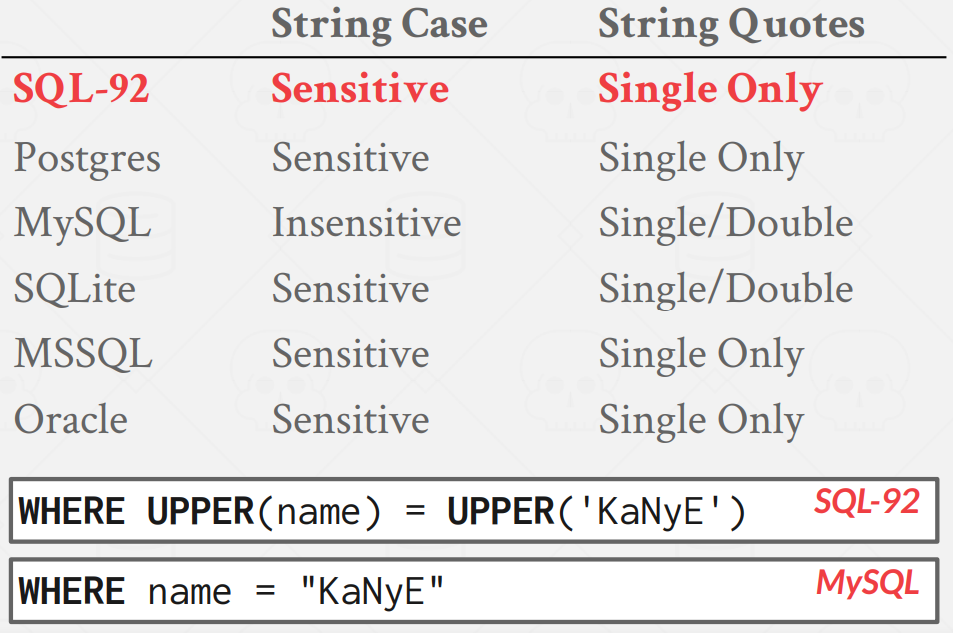

\* Important: SQL is based on bags (duplicates) not sets (no duplicates).


## AGGREGATES

Functions that return a single value from a bag of tuples

- AVG(COL)
- MIN(COL)
- MAX(COL)
- SUM(COL)
- COUNT(COL)

below are all the same:
```sql
SELECT COUNT(login) AS CNT FROM student WHERE login LIKE '%@cs';
SELECT COUNT(*) AS CNT FROM student WHERE login LIKE '%@cs';
SELECT COUNT(1) AS CNT FROM student WHERE login LIKE '%@cs';
```

COUNT, SUM, AVG support DISTINCT:
```sql
SELECT COUNT(DISTINCT login) FROM student WHERE login LIKE '%@cs';
```

Output of other columns outside of an aggregate is undefined.
```sql
SELECT AVG(s.gpa), e.cid -- this will work but e.cid is totally random.
FROM enrolled AS e JOIN student AS s
ON e.sid = s.sid
```
So how can we make that work? we need GROUP BY.

## GROUP BY

Project tuples into subsets and calculate aggregates against each subset.

```sql
SELECT AVG(s.gpa), e.cid
FROM enrolled AS e JOIN student AS s
ON e.sid = s.sid
GROUP BY e.cid
```

Non-aggregated values in SELECT output clause must appear in GROUP BY clause.

```sql
SELECT AVG(s.gpa), e.cid, s.name -- s.name must be appeared on GROUP BY clause
FROM enrolled AS e, student AS s
WHERE e.sid = s.sid
GROUP BY e.cid
```

## HAVING

Filters results based on aggregation computation. Like a **WHERE clause for a GROUP BY**.

```sql
SELECT AVG(s.gpa) AS avg_gpa, e.cid
FROM enrolled AS e, student AS s
WHERE e.sid = s.sid
GROUP BY e.cid
HAVING AVG(s.gpa) > 3.9;
```

`HAVING avg_gpa > 3.9` won't work.(some dbms lets to.) And since the database is smart enough, it won't calculate again for `AVG(s.gpa)` for `HAVING` clause.


## STRING OPERATIONS



This is why we still need to learn each sql for DBMSs.

- `LIKE` (There are regex function but with different names for each DBMSs)
  - `%` Matches any substring (including empty strings)
  - `_` Match any one character
- `SUBSTRING`, `UPPER`, ...
- `||` (Concatenation)
  - SQL-92, ORACLE : `||`
  - MSSQL : `+`
  - MySQL : `CONCAT(...)`

## DATE/TIME OPERATIONS

Operations to manipulate and modify DATE/TIME attributes. Can be used in both output and predicates. Support/syntax varies wildly.

## OUTPUT REDIRECTION

1. Store query results in another table:
- Table must not already be defined.
- Table will have the same # of columns with the same types as the input.

```sql
-- SQL-92
SELECT DISTINCT cid INTO CourseIds
FROM enrolled;

-- MySQL
CREATE TABLE CourseIds (
SELECT DISTINCT cid FROM enrolled);
```

2. Insert tuples from query into another table:

- Inner SELECT must generate the same columns as the target table.
- DBMSs have different options/syntax on what to do with integrity violations (e.g., invalid duplicates).

```sql
INSERT INTO CourseIds
(SELECT DISTINCT cid FROM enrolled);
```

## OUTPUT CONTROL

- ORDER BY

```sql
SELECT sid, grade FROM enrolled
  WHERE cid = '15-721'
  ORDER BY grade;
-- both are same.
SELECT sid, grade FROM enrolled
  WHERE cid = '15-721'
  ORDER BY 2;
```
 "Ordinal" - the number stands for the column based on the number of columns defined in the SELECT clause.

- LIMIT

```sql
SELECT sid, name FROM student
  WHERE login LIKE '%@cs'
  LIMIT 20 OFFSET 10;
```

## NESTED QUERIES

Queries containing other queries. They are often difficult to optimize. Inner queries can appear (almost) anywhere in query.

```sql
SELECT name FROM student 
  WHERE sid IN (SELECT sid FROM enrolled);
```
This seems brut-force, but optimizer will take this and convert to join statement:
```sql
SELECT name FROM student s
  JOIN enrolled e ON s.sid = e.sid;
```

These are useful for nested queries.

- ALL: Must satisfy expression for all rows in the sub-query.

```sql
-- this will return nothing since every sid is less than 99999
SELECT * FROM student WHERE sid > ALL(SELECT 99999);
```
- ANY: Must satisfy expression for at least one row in the sub-query.

```sql
SELECT name FROM student
  WHERE sid = ANY(
    SELECT sid 
      FROM enrolled 
      WHERE cid = '15-445'
);
```

- IN: Equivalent to '=ANY()'

```sql
SELECT sid, name FROM student
  WHERE sid IN (
    SELECT MAX(sid) FROM enrolled
);
-- these are equivalent
SELECT s.sid, s.name FROM student s
  JOIN (SELECT MAX(sid) AS sid FROM enrolled) AS max_e
  ON s.sid = max_e.sid;
```

- EXISTS: At least one row is returned without comparing it to an attribute in outer query.

```sql
-- since SELECT 1 always returns 1, EXISTS is vague.
SELECT * FROM student WHERE EXISTS(SELECT 1);
-- this way you can write:
SELECT * FROM student AS s 
  WHERE EXISTS(SELECT * FROM enrolled AS e WHERE e.sid = s.sid);
```

*Find all courses that have no students enrolled in it:*
```sql
SELECT * FROM course
  WHERE NOT EXISTS(
    SELECT * FROM enrolled
    WHERE course.cid = enrolled.cid
);
```

## WINDOW FUNCTIONS

Performs a "sliding" calculation across a set of tuples that are related. Like an aggregation but tuples are not grouped into a single output tuples.

```sql
SELECT ... AGGREGATION_SPECIAL_FUNC(...) OVER (how_to_slice_up_data)
FROM ...
```

- ROW_NUMBER() : # of the current row

```sql
SELECT customer_id, first_name, country, ROW_NUMBER() OVER (ORDER BY country)
FROM Customers
```  
|customer_id|first_name|country|R|
|--|--|--|--|
|5|Betty|	UAE|	1|
|3|	David|	UK|	2|
|4|	John|	UK|	3|
|1|	John|	USA|	4|
|2|	Robert|	USA|	5|

- RANK() : Order position of the current row

```sql
SELECT customer_id, first_name, country, RANK() OVER (ORDER BY country) AS R
FROM Customers
```
|customer_id|first_name|country|R|
|--|--|--|--|
|5|Betty|	UAE|	1|
|3|	David|	UK|	2|
|4|	John|	UK|	2|
|1|	John|	USA|	4|
|2|	Robert|	USA|	4|

*Find the student with the second highest grade for each course :*

```sql
SELECT * 
  FROM (
    SELECT *, RANK() OVER (PARTITION BY cid ORDER BY grade ASC) AS rank
      FROM enrolled) AS ranking
  WHERE ranking.rank = 2
```
`PARTITION BY cid ORDER BY grade` means 'Group tuples by cid Then sort by grade'.

## COMMON TABLE EXPRESSIONS

Provides a way to write auxiliary statements for use in a larger query. Think of it **like a temp** table just for one query. Alternative to nested queries and views.

```sql
WITH cteName AS (
  SELECT 1
)
SELECT * FROM cteName
```

You can bind/alias output columns to names before the AS keyword.

```sql
WITH cteName (col1, col2) AS (
  SELECT 1, 2
)
SELECT col1 + col2 FROM cteName
-- returns 3
```

*Find student record with the highest id that is enrolled in at least one course :*

```sql
WITH cteSource (maxId) AS (
  SELECT MAX(sid) FROM enrolled
)
SELECT name FROM student, cteSource
  WHERE student.sid = cteSource.maxId;
```

CTE can use recurrsion which makes sql turing complete. (postgres, mysql supports. sqlite3, mssql does not.)

*Print the sequence of numbers from 1 to 10:*
```sql
WITH RECURSIVE cteSource (counter) AS (
  (SELECT 1)
  UNION ALL
  (SELECT counter + 1 FROM cteSource
    WHERE counter < 10)
)
SELECT * FROM cteSource
```

<br><br><br>

*You should (almost) always strive to compute your answer as a single SQL statement.*