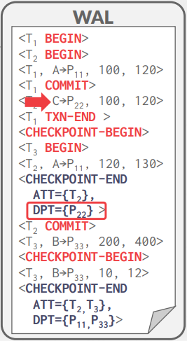

# Lecture 20. Database Recovery

Recovery algorithms have two parts:
- Actions during normal txn processing to ensure that the DBMS can recover from a failure. (L19)
- Actions after a failure to recover the database to a state that ensures atomicity, consistency, and durability. (L20)

There are three key concepts:
- `Write Ahead Logging`: Any change is recorded in log on stable storage before the database change is written to disk (STEAL + NO-FORCE).
- Repeating History During `Redo`: On restart, retrace actions and restore database to exact state before crash.
- Logging Changes During `Undo`: Record undo actions to log to ensure action is not repeated in the event of repeated failures.


We need to extend our log record format from last class to include additional info.
Every log record now includes a globally unique log sequence number (LSN).
Various components in the system keep track of LSNs that pertain to them:

<p float="left">
     
    
</p>

`pageLSN` allows comparison of data page and log records. Before the DBMS can write page $i$ to disk, it must flush log at least to the point where $pageLSN_i ≤ flushedLSN$


## 1. Normal Execution

### 1.1. Transaction Commit

1. txn wants to commit
2. DBMS writes COMMIT record to log buffer in memory
3. flushes all log records up to and including the transaction's COMMIT record to disk
4. ack back to the application that txn has committed
5. At some later point, DBMS write a special `TXN-END` record to log. This does not need to be flushed immediately. (even though this fails to be flushed, we have enough information to confirm txn's commit/abort)


### 1.2. Transaction Abort

- `prevLSN`: previous LSN for the transaction. The DBMS uses these `prevLSN` values to maintain a linked-list for each transaction that makes it easier to walk through the log to find its records.

- `CLR`: compensation log record. Actions taken to undo the actions of a previous update record.

- `undoNext`: next-to-be-undone LSN (contained in CLR)


CLR-002 is CLR for LSN 002. Note that ABORT, CLRs are added to log records but the DBMS does not wait for them to be flushed before notifying the application that the txn aborted. These can be dropped because of some failure, but we can generate them with recovery protocol.

## 2. Checkpoints

### 2.1. Blocking Checkpoints (No we don't use this)

The DBMS periodically takes checkpoints where it writes the dirty pages in its buffer pool out to disk. This is used to minimize how much of the log it has to replay upon recovery. Easy way to do this:

- Halt the start of any new transactions.
- Wait until all active transactions finish executing.
- Flush dirty pages to disk

Instead, we could just pause transactions, instead of waiting:

- Halt the start of any new transactions.
- Pause transactions while the DBMS takes the checkpoint

But then we need these kind of tables:

#### Active Transaction Table (ATT)

State of transactions that are actively running in the DBMS. Remove entry after the TXN-END record.

(txnId, status: R(Running)/C(Committing)/U(Candidate for Undo), lastLSN)


#### Dirty Page Table (DPT)

Information about the pages in the buffer pool that were modified by uncommitted transactions. Remains recLSN as the LSN of the log record that first caused the page to be dirty.


At the first checkpoint, assuming P11 was flushed, T2 is still running and there is only one dirty page (P22), At the second checkpoint, assuming P22 was flushed, T2 and T3 are active and the dirty pages are (P11, P33). This still is not ideal because the DBMS must stall txns during checkpoint.


### 2.2. Fuzzy Checkpoints

A fuzzy checkpoint is where the DBMS allows active txns to continue the run while the system writes the log records for checkpoint.

Simple modification makes algorithm not to stall txns. The DBMS uses additional log records to track checkpoint boundaries:
- `CHECKPOINT-BEGIN`: Indicates the start of the checkpoint. Any txn that begins after the checkpoint starts is excluded from the ATT in the CHECKPOINT-END record.
- `CHECKPOINT-END`: When the checkpoint has completed. It contains the ATT + DPT, captured just as the `CHECKPOINT-BEGIN` log record is written.




## 3. ARIES

Algorithms for Recovery and Isolation Exploiting Semantics (ARIES) is a recovery algorithm developed at IBM research in early 1990s for the DB2 system. It has three phases:

1. Analysis: Read the WAL(from MasterRecord) to identify dirty pages in the buffer pool and active transactions at the time
of the crash. At the end of the analysis phase the `ATT` tells the DBMS which transactions were active at the time of the crash. The `DPT` tells the DBMS which dirty pages might not have made it to disk.
2. Redo: Repeat all actions starting from the smallest `recLSN`, which is the oldest log record that may have modified a page not written to disk.
3. Undo: Reverse the actions of transactions that did not commit before the crash.


### Details

#### Analysis Phase

```
row = checkpoint
while (row != EOF) do
    begin
        if row.code = TXN-END:
            ATT.remove(row.txn)
        elif row.code = COMMIT:
            ATT[row.txn].status = COMMIT
        else:
            ATT.add(row.txn)

        if row.command = UPDATE and row.page not in DPT:
            DPT.add(row.page)
            row.page.recLSN = row.LSN
    end
```


#### Redo Phase

```
row = minrecLSN(DPT)
while (row != EOF) do
    begin
        if row.page not in DPT:
            continue
        else:
            if row.LSN < row.page.recLSN || row.LSN <= row.page.pageLSN(on disk):
                continue
            apply(row)
    end
```

At the end of the redo phase, write TXN-END log records for all transactions with status COMMIT and remove them from the ATT.


#### Undo Phase

In the last phase, the DBMS reverses all transactions that were active at the time of crash. These are all transactions with UNDO status in the ATT after the Analysis phase.

The DBMS processes transactions in reverse LSN order using the lastLSN to speed up traversal. As it
reverses the updates of a transaction, the DBMS writes a CLR entry to the log for each modification.

Once the last transaction has been successfully aborted, the DBMS flushes out the log and then is ready to
start processing new transactions.


