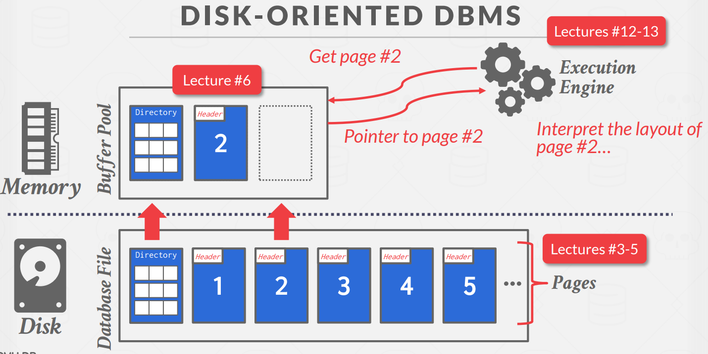
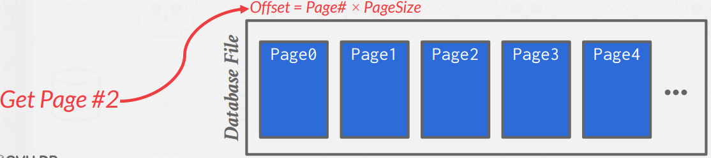
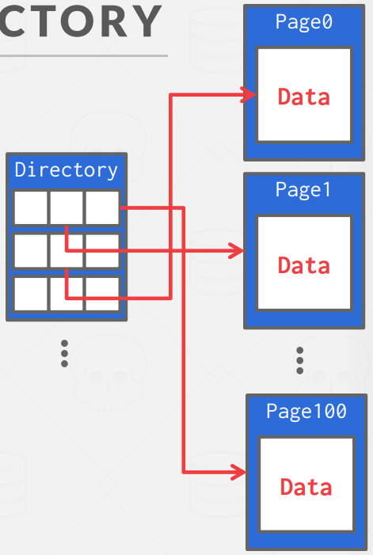
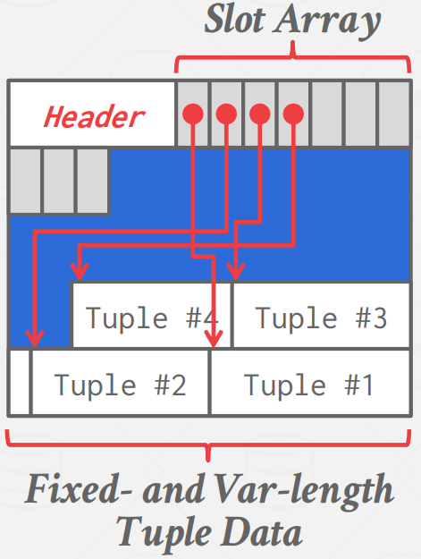
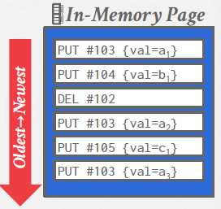
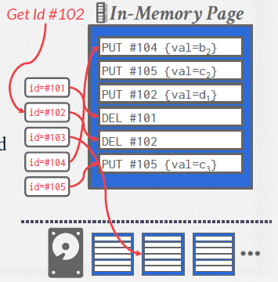
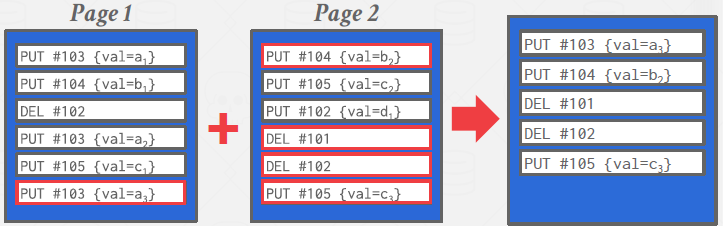
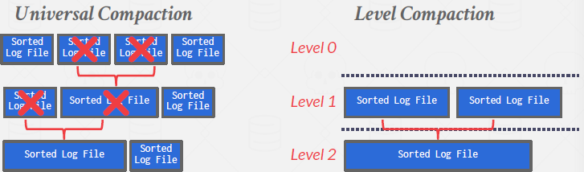
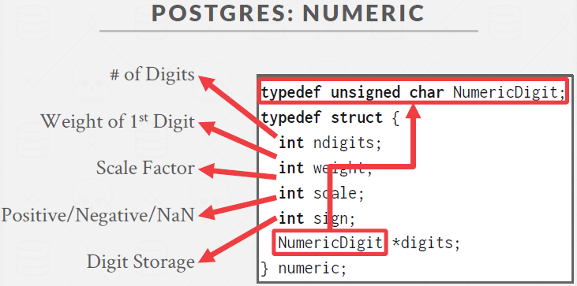

# Lecture 3. Database Storage 1

## Storage System

1. Disk-Based
   
   The DBMS assumes that the primary storage location of the database is on non-volatile disk.
The DBMS's components manage the movement of data between non-volatile and volatile storage.



2. Sequential Access

    Random access on non-volatile storage is almost always much slower than sequential access.
DBMS will want to maximize sequential access.
- Algorithms try to reduce number of writes to random
pages so that data is stored in contiguous blocks.
- Allocating multiple pages at the same time is called an
extent.

3. Why not use the OS?

    OS cannot know better than dbms.

    Problem #1: Transaction Safety

    → OS can flush dirty pages at any time.

    Problem #2: I/O Stalls

    → DBMS doesn't know which pages are in memory. The OS will stall a thread on page fault.

    Problem #3: Error Handling

    → Difficult to validate pages. Any access can cause a `SIGBUS` that the DBMS must handle.

    Problem #4: Performance Issues

    → OS data structure contention. TLB shootdowns. 

    Some dbms (monet db, IMDB, Raven db, level db, elasticsearch, quest db) uses `mmap` with `madvise`, `mlock`, `msync`.

    - `madvise`: Tell the OS how you expect to read certain pages.
    - `mlock`: Tell the OS that memory ranges cannot be paged out.
    - `msync`: Tell the OS to flush memory ranges out to disk.


## Main Topics About Database Storage

#### 1. How the DBMS represents the database in files on disk

#### 2. How the DBMS manages its memory and moves data back and forth from disk

<br>

## File Storage

The DBMS stores a database as one or more files on disk typically in a proprietary format. The OS doesn't know anything about the contents of these files. The `storage manager` is responsible for maintaining a database's files. Some do their own scheduling for reads and writes to improve spatial and temporal locality of pages. It organizes the files as a collection of `pages`.

A `page` is a fixed-size block of data. It can contain tuples, meta-data, indexes, log records, ... etc. Most systems do not mix page types. Each page is given a unique identifier. The DBMS uses an indirection layer to map page IDs to physical locations.

There are three different notions of `"pages"` in a DBMS:

→ Hardware Page (usually 4KB)

→ OS Page (usually 4KB)

→ Database Page (512B-16KB)

Different DBMSs manage pages in files on disk in different ways.

- Heap File Organization
- Tree File Organization
- Sequential / Sorted File Organization (ISAM)
- Hashing File Organization

### Heap File

A heap file is an unordered collection of pages with tuples that are stored in random order. Also supports iterating over all pages. Need meta-data to keep track of what pages exist in multiple files and which ones have free space.



The DBMS maintains special pages that tracks the location of data pages in the database files: `page directory`.Must make sure that the directory pages are in sync with the data pages. The directory also records meta-data about available space. (The number of free slots per page, List of free / empty pages)



## Page Layout

Every page contains a header of metadata about the page's contents.

- Page Size
- Checksum
- DBMS Version
- Transaction Visibility
- Compression Information

Some systems require pages to be selfcontained (e.g., Oracle), which means header has table that the page came from, schema, column, etc. That means, even if some table's metadata information is lost, dbms can restore using some data's header.

For any page storage architecture, we now need to decide how to organize the data inside of the page. We are still assuming that we are only storing tuples.

Two approaches:

- tuple oriented
- log structured


## Tuple Storage

A *strawman approach* to laying out data is to keep track of how many tuples the DBMS has stored in a page and then append to the end every time a new tuple is added. However, problems arise when tuples are deleted or when tuples have variable-length attributes.

=> **Slotted Pages**: Page maps slots to offsets.

The slot array maps "slots"(fixed length) to the tuples'(var length) starting position offsets. To add a tuple, the slot array will grow from the beginning to the end, and the data of the tuples will grow from end to the beginning. The page is considered full when the slot array and the tuple data meet.



The header keeps track of the number of used slots, the offset of the starting location of the last slow used. When compaction arise (for example, deleted Tuple #3, and compaction), it will just slide data. i.e. Tuple #4's start location goes to Tuple #3's start location.

The DBMS needs a way to keep track of individual tuples. Each tuple is assigned a unique record identifier. (commonly, `page_id` + `offset/slot`)

PostgreSQL: CTID (6 bytes)

SQLite: ROWID (8 bytes)

ORACLE: ROWID (10 bytes)


#### Denormalized Tuple Data
If two tables are related(foreign key), the DBMS can “pre-join” them, so the tables end up on the same page. This makes reads faster since the DBMS only has to load in one page rather than two separate pages. However, it makes updates more expensive since the DBMS needs more space for each tuple.

# Lecture 4. Database Storage 2

## Page-Oriented Architecture: Revisited

#### Insert a new tuple
1. Check page directory to find a page with a free slot.
2. Retrieve the page from disk (if not in memory).
3. Check slot array to find empty space in page that will fit.
   
#### Update an existing tuple using its record id
1. Check page directory to find location of page.
2. Retrieve the page from disk (if not in memory).
3. Find offset in page using slot array.
4. Overwrite existing data (if new data fits).

### What are some potential problems with the slotted page design?

- Fragmentation : Deletion of tuples can leave gaps in the pages.
- Useless Disk I/O : Due to the block-oriented nature of non-volatile storage, the whole block needs to
be read to fetch a tuple.
- Random Disk I/O : e.g., update 20 tuples on 20 pages

---

### What if the DBMS could not overwrite data in pages and could only create new pages?

- S3
- HDFS

## Log-Structured Storage

Instead of storing tuples, the DBMS only stores log records.

Stores records to file of how the database was modified (put and delete). Deletes marks the tuple as deleted. Each log record contains the tuple’s unique identifier. It's NOT 'insert', instead `put` since it can change specific record.

#### Read / Write

As the application makes changes to the database, the DBMS appends log records to the end of the file without checking previous log records. When the page gets full, the DBMS writes it out disk and starts filling up the next page with records.



To avoid long reads, the DBMS can have indexes to allow it to jump to specific locations in the log. (If log record is in-memory, read it. If log record is on a disk page, retrieve it.)



#### Compaction

The log will grow forever. So it periodically compact the log. If it had a tuple and then made an update to it, it could compact it down to just inserting the updated tuple.



After a page is compacted, the DBMS does need to maintain temporal ordering of records within the page. Could use timestamp, or just tuple id that is guaranteed to appear at most once in the page. But we can do better. The DBMS can instead sort the page based on id order to improve efficiency of future look-ups. These are called Sorted String Tables (SSTables) and they can make the tuple search
very fast.

Compaction coalesces larger log files into smaller files by removing unnecessary records. This works on disks.



The issue with compaction is that the DBMS ends up with write amplification. (It re-writes the same
data over and over again.) Universal Compaction Style is a compaction style, targeting the use cases requiring lower write amplification, trading off read amplification and space amplification.

Log-structured storage managers are more common today. This is partly due to the proliferation of RocksDB. (RocksDB, levelDB, HBASE, CockroachDB, cassandra, etc.)


## Data Representation

The data in a tuple is essentially just byte arrays. It is up to the DBMS to know how to interpret those bytes to derive the values for attributes. A data representation scheme is how a DBMS stores the bytes for a value.

There are five high level datatypes that can be stored in tuples: integers, variable-precision numbers, fixedpoint precision numbers, variable length values, and dates/times.

### 1. Integers

Most DBMSs store integers using their “native” C/C++ types as specified by the IEEE-754 standard. These
values are fixed length. 

Examples: INTEGER, BIGINT, SMALLINT, TINYINT

### 2. Variable Precision Numbers

These are inexact, variable-precision numeric types that use the “native” C/C++ types specified by IEEE-754 standard. These values are also fixed length.

Operations on variable-precision numbers are faster to compute than arbitrary precision numbers because
the CPU can execute instructions on them directly. However, there may be *rounding errors* when performing
computations due to the fact that some numbers cannot be represented precisely.

Examples: FLOAT, REAL

### 3. Fixed-Point Precision Numbers

These are numeric data types with arbitrary precision and scale. They are typically stored in exact, variablelength binary representation (almost like a string) with additional meta-data that will tell the system things like the length of the data and where the decimal should be.

These data types are used when rounding errors are unacceptable, but the DBMS pays a *performance penalty* to get this accuracy.

Examples: NUMERIC, DECIMAL.

Below is how postgres handles numeric.




### 4. Variable-Length Data

Most DBMSs do not allow a tuple to exceed the size of a single page. The ones that do store the data on
a special `overflow page` and have the tuple contain a reference to that page. These overflow pages can
contain pointers to additional overflow pages until all the data can be stored. (VARCHAR)

Some systems will let you store these large values in an `external file`, and then the tuple will contain a pointer to that file. For example, if the database is storing photo information, the DBMS can store the photos in the external files rather than having them take up large amounts of space in the DBMS. One downside of this is that the DBMS cannot manipulate the contents of this file. Thus, there are no durability or transaction protections. (BLOB)

Examples: VARCHAR, VARBINARY, TEXT, BLOB.

### 5. Dates and Times

Representations for date/time vary for different systems. Typically, these are represented as some unit time(micro/milli) seconds since the unix epoch.

Examples: TIME, DATE, TIMESTAMP.


### System Catalogs

In order for the DBMS to be able to decipher the contents of tuples, it maintains an internal catalog to tell it meta-data about the databases. The meta-data will contain:

- Tables, columns, indexes, views
- Users, permissions
- Internal statistics

Most DBMSs store their catalog inside of themselves in the format that they use for their tables. They use special code to “bootstrap” these catalog tablles.

You can query the DBMS’s internal `INFORMATION_SCHEMA` catalog to get info about the database. ANSI standard set of read-only views that provide info about all the tables, views, columns, and procedures in a database.

For example:
```sql
SELECT *
    FROM INFORMATION_SCHEMA.TABLES
    WHERE table_catalog = '<db_name>';
```


